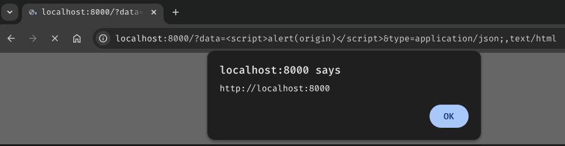
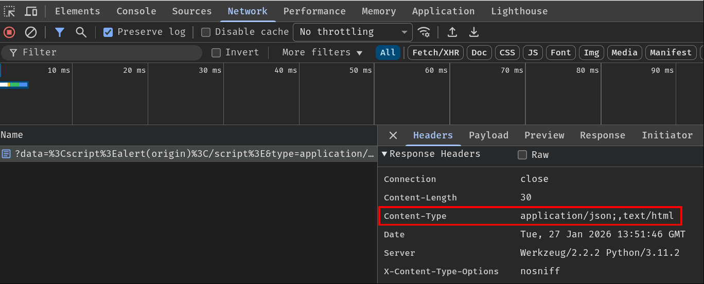

# Parse and Parse: MIME Validation Bypass to XSS via Parser Differential

This research is an extension of [`Content-Type` research from BlackFan](https://github.com/BlackFan/content-type-research/tree/master). More specifically, the [response `Content-Type` tricks](https://github.com/BlackFan/content-type-research/blob/master/XSS.md#response-content-type-tricks). Unfortunately, the multiple `Content-Type` trick is not clearly explained by BlackFan. Therefore, I'll explain and demonstrate how a single comma character can cause parsing difference between the browser and different MIME type parser libraries.

> Parser differential (parser confusion, parser mismatch, or whatever you call it) happens when two or more parsers that parse (process) the exact same input, will produce two or more different results.

Section "[Summary Table](#summary-table)" shows all the libraries/frameworks that I've tested!

## Introduction

Imagine the following Flask web application, where it allows users to return an HTTP response with arbitrary body data and `Content-Type` response header:

```python
@app.route('/')
def index():
    data = request.args.get('data', 'Hello World!')
    contentType = request.args.get('type', 'text/plain')
    [...]
    response = make_response(data)
    response.headers['X-Content-Type-Options'] = 'nosniff'
    response.headers['Content-Type'] = contentType
    return response
```

Of course, this is clearly vulnerable to reflected XSS by setting `Content-Type` header's value to `text/html`, so that the browser will parse and render the response body data as HTML code. Therefore, the developer implemented the following validation, which parses the `type` value via library [`email.message`](https://docs.python.org/3/library/email.message.html), and the parsed value must be string `application/json`:

```python
from email.message import Message

def parseContentTypeHeader(contentTypeHeader):
    msg = Message()
    msg['Content-Type'] = contentTypeHeader
    return msg.get_content_type()

@app.route('/')
def index():
    [...]
    contentType = request.args.get('type', 'text/plain')
    if (parsedContentType := parseContentTypeHeader(contentType)) != 'application/json':
        response = make_response(f'Invalid Content-Type: {parsedContentType}')
        response.headers['X-Content-Type-Options'] = 'nosniff'
        response.headers['Content-Type'] = 'text/plain'
        return response

    [...]
    response.headers['Content-Type'] = contentType
    return response
```

However, the developer used a dangerous coding pattern, which is **using the original non-validated value after validating the value**. In this case, the response header `Content-Type`'s value should be `parsedContentType` instead of `contentType` after the validation. Hence, there's a potential parser differential vulnerability in here, where both the browser and the web application sees the `Content-Type` header's value differently.

According to [the research from BlackFan](https://github.com/BlackFan/content-type-research/blob/master/XSS.md#response-content-type-tricks), we can do so with the following payload:

```
/?type=application/json;,text/html
```

- [Library `email.message` method `get_content_type`](https://docs.python.org/3/library/email.message.html#email.message.EmailMessage.get_content_type) parsed it as `application/json`
- Browser (Chromium-based and Firefox) parsed it as `text/html`





But why can a single comma character cause that parsing difference?

## List-Based and Singleton Fields

According to [RFC9110 (HTTP Semantics)](https://datatracker.ietf.org/doc/html/rfc9110#section-5.6.1), headers (fields) value can be **multivalued (list-based fields)**, which means that headers' value can be separated via a comma character. On the other hand, headers that are not list-based are called [singleton fields](https://datatracker.ietf.org/doc/html/rfc9110#section-5.5-6), which only accepts one value.

List-based field example, header [`Accept`](https://datatracker.ietf.org/doc/html/rfc9110#section-12.5.1):

```
Accept: text/html, application/xhtml+xml, application/xml;q=0.9, */*;q=0.8
```

Notably, not all headers can be a list-based field. Although the RFC didn't explicitly mention which headers must be a list-based or singleton field, the [ABNF rule](https://datatracker.ietf.org/doc/html/rfc5234) did define headers' syntax. If [list operator (`#`)](https://datatracker.ietf.org/doc/html/rfc9110#name-lists-rule-abnf-extension) or equivalent [repetition with comma delimiters](https://datatracker.ietf.org/doc/html/rfc9110#name-sender-requirements) (e.g., `1#element` or `element *( OWS "," OWS element )`) is defined in the ABNF rule, then the header must be list-based. For example, [header `Accept`'s syntax](https://datatracker.ietf.org/doc/html/rfc9110#section-12.5.1-3):

```
Accept = #( media-range [ weight ] )
```

That brings us this question: Is `Content-Type` header a singleton or list-based field?

Based on [its ABNF rule](https://datatracker.ietf.org/doc/html/rfc9110#section-8.3-2), the header can only contain one single value, [`media-type`](https://datatracker.ietf.org/doc/html/rfc9110#section-8.3.1-2):

```
Content-Type = media-type
```

Therefore, **`Content-Type` header must be a singleton field**.

## How Chromium Parses *Content-Type* Response Header

From what I'm aware of, Firefox and Chromium-based browsers treat `Content-Type` response header as a list-based field, which clearly does NOT comply with the specification:

> Although `Content-Type` is **defined as a [singleton field](https://datatracker.ietf.org/doc/html/rfc9110#section-5.5-6)**, it is sometimes incorrectly generated multiple times, resulting in a combined field value that appears to be a list. **Recipients often attempt to handle this error by using the last syntactically valid member of the list**, leading to potential interoperability and security issues if different implementations have different error handling behaviors.
>   
> - [https://datatracker.ietf.org/doc/html/rfc9110#section-8.3-7](https://datatracker.ietf.org/doc/html/rfc9110#section-8.3-7)

In this section, I'll focus on Chromium parsing logic.

### *Content-Type* Response Header Is Not Really a Singleton Field :(

In Chromium, it'll parse list-based response headers by checking if the header can be coalesced. If the header is non-coalescing, the header should be treated as a singleton field.

[`net/http/http_util.cc` line 434 - 443](https://source.chromium.org/chromium/chromium/src/+/main:net/http/http_util.cc;l=434-443;drc=7587309936e5da8661bdbf0475dc1d15ee913cca):

```cpp
bool HttpUtil::IsNonCoalescingHeader(std::string_view name) {
  [...]
  static constexpr std::string_view kNonCoalescingHeaders[] = {
      "date", "expires", "last-modified",
      "location",  // See bug 1050541 for details
      "retry-after", "set-cookie",
      // The format of auth-challenges mixes both space separated tokens and
      // comma separated properties, so coalescing on comma won't work.
      "www-authenticate", "proxy-authenticate",
      // STS specifies that UAs must not process any STS headers after the first
      // one.
      "strict-transport-security"};
  [...]
}
```

Based on the above list, it seems like header `Content-Type` could be coalesced, as it's not in the list. Does that mean Chromium treats it as a list-based field?

In response header parsing logic, class `HttpResponseHeaders` method `Parse`, Chromium calls method `AddHeader` on each header:

[`net/http/http_response_headers.cc` line 660 - 665](https://source.chromium.org/chromium/chromium/src/+/main:net/http/http_response_headers.cc;l=660-665;drc=7cac9cac0b4037c8b9b9d95d7e260c1bc348594c):

```cpp
void HttpResponseHeaders::Parse(std::string_view raw_input) {
  [...]
  while (headers.GetNext()) {
    AddHeader(status_line_len + headers.name_begin(),
              status_line_len + headers.name_end(),
              status_line_len + headers.values_begin(),
              status_line_len + headers.values_end(), ContainsCommas::kMaybe);
  }
  [...]
}
```

Which appends the header to the [parsed header vector (`parsed_`)](https://source.chromium.org/chromium/chromium/src/+/main:net/http/http_response_headers.h;l=578;drc=bf712ec1a13783224debb691ba88ad5c15b93194) and decides if the header is a list-based or singleton field:

[`net/http/http_response_headers.cc` line 954 - 964](https://source.chromium.org/chromium/chromium/src/+/main:net/http/http_response_headers.cc;l=954-964;drc=7cac9cac0b4037c8b9b9d95d7e260c1bc348594c):

```cpp
void HttpResponseHeaders::AddHeader(size_t name_begin,
                                    size_t name_end,
                                    size_t values_begin,
                                    size_t values_end,
                                    ContainsCommas contains_commas) {
  // If the header can be coalesced, then we should split it up.
  if (values_begin == values_end ||
      HttpUtil::IsNonCoalescingHeader(subrange(name_begin, name_end)) ||
      contains_commas == ContainsCommas::kNo) {
    [...]
  } else {
    std::string_view values = subrange(values_begin, values_end);
    HttpUtil::ValuesIterator it(values, ',', /*ignore_empty_values=*/false);
    while (it.GetNext()) {
      [...]
    }
  }
}
```

Since `Content-Type` can be coalesced and parameter `contains_commas`'s value is [`ContainsCommas::kMaybe`](https://source.chromium.org/chromium/chromium/src/+/main:net/http/http_response_headers.h;l=458;drc=bf712ec1a13783224debb691ba88ad5c15b93194), method `AddHeader` will treat the header as list-based and split the header's value based on the delimiter by using [class `ValuesIterator`](https://source.chromium.org/chromium/chromium/src/+/main:net/http/http_util.h;l=361-396;drc=bf712ec1a13783224debb691ba88ad5c15b93194).

After that, this method will call method `AddToParsed` to append the header name and its value to the `parsed_` vector via [`emplace_back`](https://en.cppreference.com/w/cpp/container/vector/emplace_back.html):

```cpp
void HttpResponseHeaders::AddHeader(size_t name_begin,
                                    size_t name_end,
                                    size_t values_begin,
                                    size_t values_end,
                                    ContainsCommas contains_commas) {
  // If the header can be coalesced, then we should split it up.
  if ([...]) {
    [...]
  } else {
    [...]
    while (it.GetNext()) {
      // Calculate offsets of each value in [values_begin, values_end], relative
      // to the start of `raw_headers_`.
      size_t value_begin = values_begin + it.value_begin();
      size_t value_end = values_begin + it.value_end();

      AddToParsed(name_begin, name_end, value_begin, value_end);
      [...]
    }
  }
}
```

[`net/http/http_response_headers.cc` line 973 - 978](https://source.chromium.org/chromium/chromium/src/+/main:net/http/http_response_headers.cc;l=973-978;drc=bf712ec1a13783224debb691ba88ad5c15b93194):

```cpp
void HttpResponseHeaders::AddToParsed(size_t name_begin,
                                      size_t name_end,
                                      size_t value_begin,
                                      size_t value_end) {
  parsed_.emplace_back(name_begin, name_end, value_begin, value_end);
}
```

Based on the above parsing logic, **Chromium treats the `Content-Type` response header as a list-based field**. Therefore, if the header is the following:

```
Content-Type: application/json,text/html
```

Method `HttpResponseHeaders::Parse` will ultimately append the following elements to the parsed headers vector (`parsed_`):

```
Content-Type: application/json
Content-Type: text/html
```

### Last Match Wins Problem

The next question is: How does Chromium parse the `Content-Type` response header's *value* (MIME type)?

To parse the header's value, Chromium calls method `GetMimeTypeAndCharset` in class `HttpResponseHeaders`:

[`net/http/http_response_headers.cc` line 1044 - 1056](https://source.chromium.org/chromium/chromium/src/+/main:net/http/http_response_headers.cc;l=1044-1056;drc=79c84d61487467de906189e30f23a652a10283c9):

```cpp
void HttpResponseHeaders::GetMimeTypeAndCharset(std::string* mime_type,
                                                std::string* charset) const {
  mime_type->clear();
  [...]
  size_t iter = 0;
  while ((value = EnumerateHeader(&iter, "content-type"))) {
    [...]
  }
}
```

To iterate each parsed `Content-Type` header(s), the method calls `EnumerateHeader` and returns the header's value. Based on [the comment in `EnumerateHeader`](https://source.chromium.org/chromium/chromium/src/+/main:net/http/http_response_headers.h;l=269-298;drc=bf712ec1a13783224debb691ba88ad5c15b93194), if the `size_t` variable `iter` is `0` and it passes the argument by address, comma-separated lists are parsed as unique headers:

[`net/http/http_response_headers.cc` line 745 - 767](https://source.chromium.org/chromium/chromium/src/+/main:net/http/http_response_headers.cc;l=745-767;drc=a9f09a1411a697ace066a84efd018f49c28cc8a3):

```cpp
std::optional<std::string_view> HttpResponseHeaders::EnumerateHeader(
    size_t* iter,
    std::string_view name) const {
  size_t i;
  if (!iter || !*iter) {
    i = FindHeader(0, name);
  } else {
    [...]
  }
  [...]
  return header_value(parsed_[i]);
}
```

After getting the header's value, method `GetMimeTypeAndCharset` will then call static method `ParseContentType` in class `HttpUtil`, which calls method `ParseMimeType` to parse the given MIME type string.

[`net/http/http_util.cc` line 109 - 116](https://source.chromium.org/chromium/chromium/src/+/main:net/http/http_util.cc;l=109-116;drc=b487025faae454db2403a4e7189efd592c0b208a):

```cpp
void HttpUtil::ParseContentType(std::string_view content_type_str,
                                std::string* mime_type,
                                std::string* charset,
                                bool* had_charset,
                                std::string* boundary) {
  std::string mime_type_value;
  base::StringPairs params;
  bool result = ParseMimeType(content_type_str, &mime_type_value, &params);
  [...]
```

Let's use the payload from the very beginning of this blog post (`application/json;,text/html`) as an example!

> Note: We'll get back to that semicolon character (`;`) later.

- First iteration (`application/json;`):

Inside method `ParseMimeType`, it'll try to parse the MIME type string to see if the syntax is valid or not. Since our MIME type string is syntactically correct, the method returns `true`, meaning that the MIME type string can be parsed.

[`net/base/mime_util.cc` line 515 - 624](https://source.chromium.org/chromium/chromium/src/+/main:net/base/mime_util.cc;l=515-624;drc=b487025faae454db2403a4e7189efd592c0b208a):

```cpp
bool ParseMimeType(std::string_view type_str,
                   std::string* mime_type,
                   base::StringPairs* params) {
  // Trim leading and trailing whitespace from type.  We include '(' in
  // the trailing trim set to catch media-type comments, which are not at all
  // standard, but may occur in rare cases.
  size_t type_val = type_str.find_first_not_of(HTTP_LWS);
  type_val = std::min(type_val, type_str.length());
  size_t type_end = type_str.find_first_of(HTTP_LWS ";(", type_val);
  if (type_end == std::string::npos)
    type_end = type_str.length();

  // Reject a mime-type if it does not include a slash.
  size_t slash_pos = type_str.find_first_of('/');
  if (slash_pos == std::string::npos || slash_pos > type_end)
    return false;
  [...]
  return true;
}
```

Since method `ParseMimeType` returns `true`, static method `ParseContentType` will then check if our MIME type string is the same as the parsed `mime_type`. However, since `mime_type` is cleared in the first loop iteration (`mime_type->clear();` back in method `GetMimeTypeAndCharset`), it'll set `mime_type` pointer's value to our MIME type string:

```cpp
void HttpUtil::ParseContentType(std::string_view content_type_str,
                                std::string* mime_type,
                                std::string* charset,
                                bool* had_charset,
                                std::string* boundary) {
  [...]
  bool eq = base::EqualsCaseInsensitiveASCII(mime_type_value, *mime_type);
  if (!eq) {
    *mime_type = base::ToLowerASCII(mime_type_value);
  }
}
```

- Second iteration (`text/html`):

Inside method `ParseMimeType`, our MIME type string is, again, syntactically correct. This time, however, since `mime_type` is not falsey anymore due to the previous loop, **it'll overwrite previous `mime_type` with this new value** and return `true`:

[`net/base/mime_util.cc` line 531 - 532](https://source.chromium.org/chromium/chromium/src/+/main:net/base/mime_util.cc;l=531-532;drc=b487025faae454db2403a4e7189efd592c0b208a):

```cpp
bool ParseMimeType(std::string_view type_str,
                   std::string* mime_type,
                   base::StringPairs* params) {
  [...]
  if (mime_type)
    *mime_type = type_str.substr(type_val, type_end - type_val);
  [...]
}
```

Therefore, the final MIME type string is the **last valid MIME type string**. In our case, it is `text/html`.

This behavior is [documented in the RFC](https://datatracker.ietf.org/doc/html/rfc9110#section-8.3-7), and it's not compliant with the specification:

> [...]. **Recipients often attempt to handle this error by using the last syntactically valid member of the list**, leading to potential interoperability and security issues if different implementations have different error handling behaviors.

## Bypassing MIME Validation via List-Based Field Parser Differential

Now that we learned the root cause of the "Multiple Content-Type" trick, it's time to abuse this list-based field feature to bypass some MIME validations!

Based on my tested libraries, all MIME type parser libraries will follow the [MIME parsing specification](https://mimesniff.spec.whatwg.org/#parsing-a-mime-type) instead of browser's [fetch standard](https://fetch.spec.whatwg.org/#example-extract-a-mime-type). Therefore, those libraries do NOT support list-based field and will not split the MIME type string with a comma character. Also, parsers will most likely only match the first syntactically valid MIME type string.

Not only that, in the specification, MIME type's [parameter name should only contain HTTP token code points](https://mimesniff.spec.whatwg.org/#ref-for-http-token-code-point%E2%91%A2), which means comma and forward slash characters are NOT allowed. However, most parsers are very lenient towards the allowed characters in the parameter name. For the parameter's value, [it should only contain HTTP quoted-string token code points](https://mimesniff.spec.whatwg.org/#ref-for-http-quoted-string-token-code-point%E2%91%A0), which allows comma and forward slash characters. Unfortunately, some parsers are very strict towards the parameter value and those special characters must be inside a double-quoted string (i.e.: `foo="text/html"`).

In MIME type, a parameter is everything after the [subtype](https://mimesniff.spec.whatwg.org/#subtype) (text/**html**) and the parameter delimiter (Semicolon). Example:

```
text/html;key=value
```

- [Type](https://mimesniff.spec.whatwg.org/#type): `text`
- [Subtype](https://mimesniff.spec.whatwg.org/#subtype): `html`
- [Essence](https://mimesniff.spec.whatwg.org/#mime-type-essence): `text/html`
- [Parameters](https://mimesniff.spec.whatwg.org/#parameters):
    - `key`: `value`

With those in mind, let's take a look at some bypass examples!

### Extremely Lenient Parser: Python `email.message`

At the very beginning of this research, I demonstrated how the MIME validation can be bypassed, and the browser parsed the body data as HTML code via the following payload:

```
application/json;,text/html
```

Where two parsers parsed the input as the following result:
- Python library `email.message`: `application/json`
- Browser: `text/html`

Why? Well, in Python library `email.message`, the `get_content_type` method will simply split the MIME type string with the parameter delimiter:

[`Lib/email/message.py` line 608 - 630](https://github.com/python/cpython/blob/7af0d0607d50e53efabb836f551e5e8d7c4510e8/Lib/email/message.py#L608-L630):

```python
class Message:
    [...]
    def get_content_type(self):
        [...]
        ctype = _splitparam(value)[0].lower()
        [...]
```

[`Lib/email/message.py` line 29 - 37](https://github.com/python/cpython/blob/7af0d0607d50e53efabb836f551e5e8d7c4510e8/Lib/email/message.py#L29-L37):

```python
def _splitparam(param):
    # Split header parameters.  BAW: this may be too simple.  It isn't
    # strictly RFC 2045 (section 5.1) compliant, but it catches most headers
    # found in the wild.  We may eventually need a full fledged parser.
    # RDM: we might have a Header here; for now just stringify it.
    a, sep, b = str(param).partition(';')
    if not sep:
        return a.strip(), None
    return a.strip(), b.strip()
```

Of course, this implementation didn't comply with the specification at all and has no character validation against our MIME type string. Moreover, it'll return the MIME essence (`a`) if our MIME type string doesn't contain the parameter delimiter. If it does contain the delimiter, the function returns the MIME essence and presumably parameters (`b`) by using method [`partition`](https://docs.python.org/3/library/stdtypes.html#str.partition):

```shell
└> python3
[...]
>>> 'application/json;text/html'.partition(';')
('application/json', ';', 'text/html')
```

After splitting the parameters, method `get_content_type` will ultimately use the returned MIME essence value and discard the parameters:

```python
class Message:
    [...]
    def get_content_type(self):
        [...]
        ctype = _splitparam(value)[0].lower()
        [...]
```

However, we cannot simply use the payload `application/json,text/html`. Because the method will check that the MIME essence doesn't contain more than 1 forward slash character. Otherwise, it'll deem the MIME essence as invalid and return the default MIME essence, `text/plain`:

```python
class Message:
    [...]
    def get_content_type(self):
        [...]
        ctype = _splitparam(value)[0].lower()
        # RFC 2045, section 5.2 says if its invalid, use text/plain
        if ctype.count('/') != 1:
            return 'text/plain'
        return ctype
```

To bypass this check, we can simply "hide" our `text/html` in the parameter, as it's not used by method `get_content_type`. That's why most of the time the payload must have the parameter delimiter:

```
application/json;,text/html
```

- MIME essence: `application/json`
- Parameters:
    - `,text/html`: An empty string

### Requires Parameter Name-Value Pair: Python *googleapiclient.mimeparse* (Plus a Weird Quirk in Chromium)

Some parsers, such as [`googleapiclient.mimeparse`](https://googleapis.github.io/google-api-python-client/docs/epy/googleapiclient.mimeparse-module.html#parse_mime_type), require the MIME type string to have a name-value pair during parameter parsing state:

```python
from googleapiclient.mimeparse import parse_mime_type

def parseContentTypeHeader(contentTypeHeader):
    type, subtype, parameters = parse_mime_type(contentTypeHeader)
    return f'{type}/{subtype}'
```

If we use payload `application/json;,text/html`, it'll throw a `ValueError` exception. Why? Well, that's because it expects each parameter should contain an equals sign character (`=`) when parsing the parameters:

[`googleapiclient/mimeparse.py` line 45 - 48](https://github.com/googleapis/google-api-python-client/blob/049bdb69d976ff4e941fb3ee503e793caca5bf39/googleapiclient/mimeparse.py#L45-L48):

```python
def parse_mime_type(mime_type):
    [...]
    parts = mime_type.split(";")
    params = dict(
        [tuple([s.strip() for s in param.split("=", 1)]) for param in parts[1:]]
    )
    [...]
```

Since our parameter `,text/html` does not contain an equals sign character, the tuple will only have 1 element from the `split` method call, and thus can't be converted into a dictionary data type.

To fix this issue, we can just add an equals sign character to our payload's parameter name or value.

Parameter name:

```
application/json;=,text/html
```

- MIME essence: `application/json`
- Parameters:
    - An empty string: `,text/html`

Parameter value:

```
application/json;,text/html,=
```

- MIME essence: `application/json`
- Parameters:
    - `,text/html,`: An empty string

> Remember browser use the *last syntactically valid* MIME type string. In this case, it is `text/html`. 

Or this: *(Chromium-based browsers only)*

```
application/json;,text/html(=
```

- MIME essence: `application/json`
- Parameters:
    - `,text/html(`: An empty string

This one, however, leverages one weird quirk on how Chromium determines where the MIME type ends. You might have noticed this back in section "[Last Match Wins Problem](#last-match-wins-problem)" or [BlackFan's "Mime-type separators"](https://github.com/BlackFan/content-type-research/blob/master/XSS.md#response-content-type-tricks) trick:

```cpp
bool ParseMimeType(std::string_view type_str,
                   std::string* mime_type,
                   base::StringPairs* params) {
  // Trim leading and trailing whitespace from type.  We include '(' in
  // the trailing trim set to catch media-type comments, which are not at all
  // standard, but may occur in rare cases.
  [...]
  size_t type_end = type_str.find_first_of(HTTP_LWS ";(", type_val);
  [...]
}
```

Turns out, Chromium will treat open parenthesis character (`(`) as a MIME type comment's delimiter and everything before that becomes the MIME essence, which, according to the comment, does not exist in the specification. Therefore, we can leverage this weird MIME type parsing quirk to basically "comment out" some characters and everything will be ignored after the open parenthesis character, such as our equals sign character:

MIME type string `application/json;,text/html(=`:
- What Chromium will see:
    - MIME essence: `text/html`
    - No parameters ([`net/base/mime_util.cc` line 551 - 558](https://source.chromium.org/chromium/chromium/src/+/main:net/base/mime_util.cc;l=551-558;drc=b487025faae454db2403a4e7189efd592c0b208a))

This weird quirk might enable another parser differential technique, but I just couldn't figure out how to leverage this.

## Summary Table

| Parser                                                                                                                                                       | Payload Parsing Result ID | Support List-based Field? | Last Match Wins? | Strict Characters Validation?  |
|--------------------------------------------------------------------------------------------------------------------------------------------------------------|---------------------------|---------------------------|------------------|--------------------------------|
| Chromium                                                                                                                                                     | 2                         | ✅                        | ✅               | ✅                             |
| Firefox                                                                                                                                                      | 2                         | ✅                        | ✅               | ✅                             |
| [`email.message.EmailMessage`](https://docs.python.org/3/library/email.message.html#email.message.EmailMessage.get_content_type) (Python)                    | 1                         | ❌                        | ❌               | ❌                             |
| [`cgi`](https://docs.python.org/3.12/library/cgi.html#cgi.parse_header) (Python)                                                                             | 1                         | ❌                        | ❌               | ❌                             |
| [`werkzeug.http`](https://werkzeug.palletsprojects.com/en/stable/http/#werkzeug.http.parse_options_header) (Python)                                          | 1                         | ❌                        | ❌               | ❌                             |
| [`python-mimeparse`](https://pypi.org/project/python-mimeparse/#functions) (Python)                                                                          | 1                         | ❌                        | ❌               | ❌                             |
| [`rigour.mime`](https://rigour.followthemoney.tech/mime/#rigour.mime.parse_mimetype) (Python)                                                                | 3                         | ❌                        | ❌               | ✅                             |
| [`requests.utils`](https://github.com/psf/requests/blob/70298332899f25826e35e42f8d83425124f755a5/src/requests/utils.py#L504-L526) (Python)                   | 1                         | ❌                        | ❌               | ❌                             |
| [`googleapiclient.mimeparse`](https://googleapis.github.io/google-api-python-client/docs/epy/googleapiclient.mimeparse-module.html#parse_mime_type) (Python) | 4                         | ❌                        | ❌               | ❌                             |
| [`fileeye/mimemap`](https://fileeye.github.io/MimeMap/classes/FileEye-MimeMap-Type.html) (PHP)                                                               | 1                         | ❌                        | ❌               | ❌                             |
| [PEAR `MIME_Type`](https://pear.php.net/package/MIME_Type/docs/1.4.1/MIME_Type/MIME_Type.html#methodparse) (PHP)                                             | 1                         | ❌                        | ❌               | ❌                             |
| [Express.js's `Response` object](https://github.com/expressjs/express/blob/a479419b16f5b97eb20f5dbae5848708ff30ce2d/lib/response.js#L665-L686) (JavaScript)  | 3                         | ❌                        | ❌               | ✅                             |
| [`whatwg-mimetype`](https://github.com/jsdom/whatwg-mimetype?tab=readme-ov-file#mimetype) (JavaScript)                                                       | 1                         | ❌                        | ❌               | ❌                             |
| [Node.js `util.MIMEType`](https://nodejs.org/api/util.html#new-mimetypeinput) (JavaScript)                                                                   | 1                         | ❌                        | ❌               | ❌                             |
| [`mime-types`](https://github.com/jshttp/mime-types/?tab=readme-ov-file#mimecontenttypetype) (JavaScript)                                                    | 1                         | ❌                        | ❌               | ❌                             |
| [`content-type`](https://github.com/jshttp/content-type?tab=readme-ov-file#contenttypeparsestring) (JavaScript)                                              | 3                         | ❌                        | ❌               | ✅                             |
| [`busboy`](https://github.com/mscdex/busboy/blob/6b3dcf69d38c1a8d53a0b3e4c88ba296f6c91525/lib/utils.js#L3-L46) (JavaScript)                                  | 3                         | ❌                        | ❌               | ✅                             |

Payload parsing result table:

| ID | Payload                        | Result                                                          | Remarks                                  |
|----|--------------------------------|-----------------------------------------------------------------|------------------------------------------|
| 1  | `application/json;,text/html`  | `application/json`                                              |                                          |
| 2  | `application/json;,text/html`  | `text/html`                                                     |                                          |
| 3  | `application/json;,text/html`  | Throw exception/return default type (Usually it's `text/plain`) |                                          |
| 4  | `application/json;=,text/html` | `application/json`                                              | Requires valid parameter name-value pair |

## Conclusion

Parser differentials are still, in my opinion, under-research. The more parser libraries emerge, the higher the chance to have parsing differentials. In this research, I extended [BlackFan's response `Content-Type` tricks research](https://github.com/BlackFan/content-type-research/blob/master/XSS.md#response-content-type-tricks) and learned how parsers parse MIME type strings. I hope you learned something new about some weird MIME type string parsing quirks and potentially found a new parser differential technique!