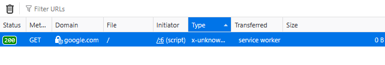
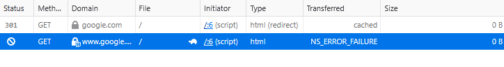
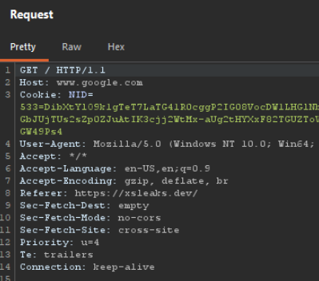
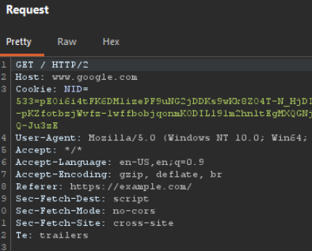

This is a mini-investigation that happened in the [CTBB discord](https://www.criticalthinkingpodcast.io/discord-landing/). From asking a simple question we go deep into the browser's darkest secrets and accidentally uncover what is essentially a bypass of Opaque Response Blocking (ORB) for the purposes of an XS-Leak.

As all good investigations go, let's first collect our evidence...

## The evidence

User `@wenwiper.` (Wiper) asked an [innocent question](https://discord.com/channels/1110206757227216916/1168685918920638614/1535446896389394462) in the `#hacking` channel about some weird behavior they encountered:

> Hey everyone, I'm learning about XS-Leaks from https://xsleaks.dev/, and I ran the following script on https://xsleaks.dev/docs/attacks/error-events/ in the console (on the same page):
>
> ```js
> function probeError(url) {
>   let script = document.createElement('script');
>   script.src = url;
>   script.onload = () => console.log('Onload event triggered');
>   script.onerror = () => console.log('Error event triggered');
>   document.head.appendChild(script);
> }
> 
> // because google.com returns HTTP 200, the script triggers onload event
> probeError('https://google.com/');
> ```
> 
> As expected, I get `Onload event triggered in the console`. However, when I run it on a different website, I get `Error event triggered` instead. I know this may be due to browser security mechanisms such as opaque response blocking, but then why does it succeed for the xsleaks website?

A lot of important information is already given here.

* They are trying to detect the **status code** of a response by looking for the script `error` (4XX) or `load` (2XX) event.
* On https://xsleaks.dev, the technique worked
* On https://example.com, the technique didn't work

Then some more messages made it weirder:

> This is on firefox btw, on chrome I always get `ERR_BLOCKED_BY_ORB` which makes sense. Also the requests and responses are the same on chrome, unlike firefox which I also find weird (like the redirect on example.com but no xsleaks.dev).  
> Tried this in private mode on firefox and it doesn't work anymore, the request looks exactly the same as from example.com.

So according to them:

* It only happens in Firefox
* When it works, `https://google.com` isn't redirected to `https://www.google.com` but instead instantly gets a response in the Network tab
* It doesn't work in Firefox private mode

Can you, reader, figure out how all these things can be true? Or, as Wiper nicely put it: 

> what the f\*ck is going on?

## Reproducing

I quickly opened my Firefox, visited xsleaks.dev and example.com and ran the JavaScript code in both consoles. Unfortunately I wasn't able to reproduce it, both just said `Error event triggered`. So far we've only seen it be reproduced on Wiper's personal Firefox instance on https://xsleaks.dev, nowhere else. My thinking is now that it has to be something stored in Wiper's browser that's making a difference, could be cookies, a service worker, or an extension maybe?

I asked to Wiper if he could try it on a new profile to confirm the "stored" theory even more, and to inspect the difference in HTTP traffic between xsleaks.dev and example.com in Burp Suite. Why would one response error and the other be successfully loaded as a script?

> The onload event is also triggered in a new profile and it's still triggered even when all extensions are disabled.

That's strange, it still works on a new profile which should rule out it beign stored. And it has nothing to do with extensions.

Then I tried reproducing it again. And now it worked! Weirdly, I could also reproduce it on *Chrome*. I consistently got `Onload event triggered in the console` on xsleaks.dev and `Error event triggered` on example.com. Now the question remains, why?

## First clue: Service Worker

The original poster already mentioned the error might have to do with [Opaque Response Blocking (ORB)](https://github.com/annevk/orb). This is a security feature that blocks resource loads (eg. `<script>` tags) where the response's content type does not match its destination at a process-level. Because cross-origin resource loads don't use CORS, such features would otherwise be impossible to mitigate from Spectre attacks. When the browser sees a `text/html` response to a request, the ORB algorithm parses the content as JavaScript, and if it doesn't pass, blocks the request.

Important to understand is that the `load` event is triggered even when a script contains syntax/runtime errors. An `error` event is only sent if something network-wise fails. The XS-Leak takes advantage of the fact that the browser treats a 4XX response code as a network failure, triggering the `error` event. With ORB in the mix, however, any cross-origin content that doesn't parse as valid JavaScript *also* becomes a network error, triggering the `error` event. So it is logical to assume this is the reason the XS-Leak is not working like we see for example.com.

But now what's the difference with xsleaks.dev where it *does* work? Looking at the network tab of a successful load something caught my eye:



The **Transferred** column says "service worker". Compare that to the error case, where there are 2 requests, the last of which failing with a generic `NS_ERROR_FAILURE` (likely ORB): 



Checking the Sources of xsleaks.dev, sure enough, we find a **service worker** is registered from https://xsleaks.dev/sw.js:

```js
const cacheName = self.location.pathname
const pages = [];

self.addEventListener("install", function (event) {
  self.skipWaiting();

  caches.open(cacheName).then((cache) => {
    return cache.addAll(pages);
  });
});

self.addEventListener("fetch", (event) => {
  const request = event.request;
  ...
  function cacheable(response) {
    return response.type === "basic" && response.ok && !response.headers.has("Content-Disposition")
  }

  event.respondWith(fetch(request).then(saveToCache).catch(serveFromCache));
});
```

Service worker's `fetch` triggers even for cross-origin background requests. The responses are just opaque, meaning we can't read them, only pass them through. The `response.type` for the cross-origin script is `"opaque"`, so we never hit the caching system for our purposes. The logic essentially boils down to:

```js
self.addEventListener("fetch", (event) => {
  event.respondWith(fetch(event.request));
});
```

We found *a* difference, but is it *the* difference? We can Unregister the service worker temporarily and try to XS-Leak again to see if it fails now on xsleaks.dev:

```js
probeError('https://google.com');  // Error event triggered
```

It does! That confirms the service worker is the culprit. It also perfectly explains the "randomness" of it working in only some browsers. The reason is that [`navigator.serviceWorker.register()`](https://developer.mozilla.org/en-US/docs/Web/API/ServiceWorkerContainer/register) doesn't immediately take over all open tabs. You must reload the tab or navigate once for it to activate. Normally, you would immediately control all open tabs by invoking [`clients.claim()`](https://developer.mozilla.org/en-US/docs/Web/API/Clients/claim):

```js
self.addEventListener("activate", (event) => {
  event.waitUntil(clients.claim());
});
```

But xsleaks.dev's service worker doesn't do this. So in all the testing between browsers, we visited the xsleaks.dev website once and immediately opened the console to test. The service worker was registered but not connected to the tab yet, so requests weren't affected by it yet. Only after testing a 2nd time does the service worker claim the client automatically and can we reproduce the bug.

## Second clue: Sec-Fetch-Dest

We've determined the service worker is the cause, but we still aren't at the root cause. We should continue to ask ourselves "why?". All the service worker does is listen for the `fetch` event, then fetches the request for you, and returns you the response. Shouldn't that be a [no-op](https://en.wikipedia.org/wiki/NOP_(code))?

In one more bit of information we can see another difference. Not in the network tab but in the raw HTTP requests:

**From xsleaks.dev**:



**From example.com**:



It's subtle, but one header [`Sec-Fetch-Dest:`](https://developer.mozilla.org/en-US/docs/Web/HTTP/Reference/Headers/Sec-Fetch-Dest) changes from `script` to `empty` on xsleaks.dev. When loading a resource, this header tells the server where it will end up. For `fetch()`, this is always set to `empty` because the browser doesn't know what will be done with its response. This also counts for service workers. So, what's happening is that the `fetch()` "proxy" by the service worker is actually silently rewriting the *destination* of the request.

## The nail in the coffin

We now know the exact observed behavior, and have something to look for. Reading through [Chromium's ORB source code](https://source.chromium.org/chromium/chromium/src/+/main:services/network/orb/orb_impl.cc;l=493-497?q=services%2Fnetwork%2Forb%2Forb_impl.cc&ss=chromium) we find the last piece of evidence we need:

```c++
ResponseAnalyzer::BlockedResponseHandling
OpaqueResponseBlockingAnalyzer::ShouldHandleBlockedResponseAs() const {
  ...

  if (request_destination_from_renderer_ != mojom::RequestDestination::kEmpty) {
    return BlockedResponseHandling::kNetworkError;
  }

  return BlockedResponseHandling::kEmptyResponse;
}
```

It can't get clearer than this. If the destination is **not** "empty" (example.com), return a network error. Otherwise, it **is** "empty" (xsleaks.dev), return a successful but blank response. When a script tag receives a network error, it always throws the `error` event, no matter the status code. But if it receives a blank response, the network layer checks the status code to determine whether to throw an `error` event or start executing the JavaScript and trigger `load`. In this case, the JavaScript in question will be 0 bytes, blank, so nothing actually executes.

For our XS-Leak purposes that means when ORB normally blocks the response, a service worker overwriting the destination *changes* it to not be a network error and lets us differentiate the ORB error from a 4XX error.

What's better, **we control** the service worker, so we can intentionally set such a service worker on our site to rewrite the destination of probing script tags and determine the status code of any cross-origin page successfully.

`sw.js`:

```js
self.addEventListener("install", () => {
  self.skipWaiting();  // Instantly activate
});

self.addEventListener("message", (event) => {
  if (event.data === "CLAIM") {
    event.waitUntil(clients.claim());  // Connect to open tabs
  }
});

self.addEventListener("fetch", (event) => {
  event.respondWith(fetch(event.request));  // Overwrite destination to "empty" by proxying
});
```

`exploit.js`:

```js
// Install service worker and wait until ready
await navigator.serviceWorker.register("/sw.js");
(await navigator.serviceWorker.ready).active.postMessage("CLAIM");
if (!navigator.serviceWorker.controller) {
  await new Promise((resolve) => {
    navigator.serviceWorker.addEventListener("controllerchange", resolve, { once: true });
  });
}

function probeError(url) {
  return new Promise((resolve, reject) => {
    let script = document.createElement('script');
    script.src = url;
    script.onload = () => resolve(true);
    script.onerror = () => resolve(false);
    document.head.appendChild(script);
  });
}

// XS-Leak
console.log(await probeError("https://google.com"));      // true
console.log(await probeError("https://google.com/404"));  // false
```

This is why you ask questions folks, we just fixed an anchient XS-Leak to work in modern browsers!