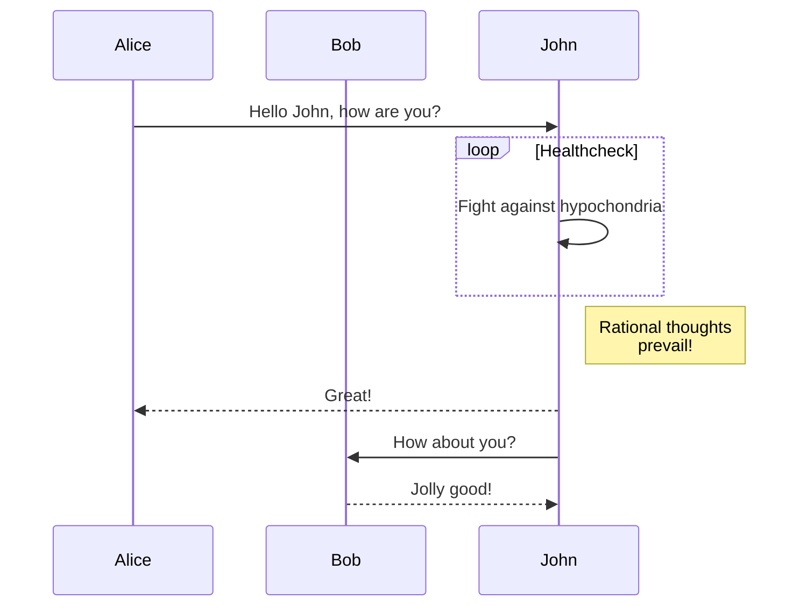

# H1
## H2
### H3
#### H4
##### H5
###### H6

Plain text

**Bold text** - __Bold text__.

*Italic text* - _Italic text_.

***Bold + italic*** - ___Bold + italic___

~~Strikethrough~~

Superscript can be done with HTML tags: 
x<sup>2</sup> and Subscript: H<sub>2</sub>O 


[Basic Link to Google](https://www.google.com)
[Link with Title](https://www.google.com "Google's Homepage")
<https://ctbb.show/> - Automatic URL Linking


## Images

[](https://example.com)


## Lists
* Item 1
* Item 2
  * Nested Item 2.1
  * Nested Item 2.2
* Item 3


1. First Item
2. Second Item
   1. Nested Item 2.1
   2. Nested Item 2.2
3. Third Item


### Task Lists
- [x] Completed task
- [ ] Incomplete task
- [ ] \(Optional) Advanced task


## Blockquotes
> This is a blockquote
> 
> It can span multiple lines

> Nested blockquotes
>> Are also possible
>>> And can go deeper


## Code Formatting
Inline code uses `backticks`.


```
Code blocks use
triple backticks
```


```python
# Python code highlighting
def fibonacci(n):
    if n <= 1:
        return n
    else:
        return fibonacci(n-1) + fibonacci(n-2)
```


## Tables

| Header 1 | Header 2 | Header 3 |
|----------|----------|----------|
| Cell 1   | Cell 2   | Cell 3   |
| Cell 4   | Cell 5   | Cell 6   |

### Alignment in Tables

| Left-aligned | Center-aligned | Right-aligned |
|:-------------|:--------------:|--------------:|
| Left         | Center         | Right         |
| Text         | Text           | Text          |

## Horizontal Rules
Three or more hyphens, asterisks, or underscores:

---
***
___


## Escape Characters

\*Not italic\*
\`Not code\`
\[Not a link\](http://example.com)


## HTML in Markdown
<div style="color: blue;">
  This is <em>HTML</em> content inside markdown.
</div>

<details>
  <summary>Click to expand</summary>
  
  Hidden content goes here. Can include **markdown**!
</details>

## Embedding Media
<iframe width="560" height="315" src="https://www.youtube.com/embed/dQw4w9WgXcQ" frameborder="0" allowfullscreen></iframe>


## Diagrams




## Admonitions/Callouts (if supported)

> :warning: **Warning:** This is a warning admonition

> :bulb: **Tip:** This is a tip admonition

> :memo: **Note:** This is a note admonition


## Conclusion

This template showcases the majority of Markdown features that might be useful in your articles. Not all features may be supported by your specific Markdown processor or Jekyll theme, but this provides a comprehensive reference.

## Footnotes

Here's a simple footnote[^1].

[^1]: This is the footnote content.

Here's a more complex footnote[^2].

[^2]: This footnote has multiple paragraphs.
    
    It can contain code, blocks, and other formatting.


## References
1. [CommonMark Spec](https://commonmark.org/)
2. [GitHub Flavored Markdown](https://github.github.com/gfm/)
3. [Markdown Guide](https://www.markdownguide.org/)
