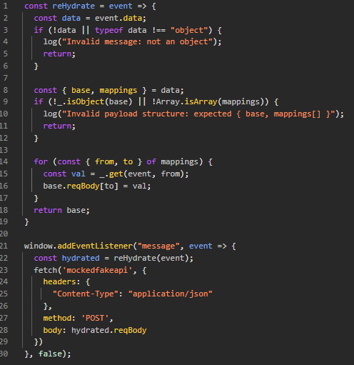
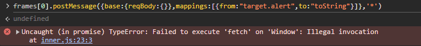
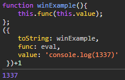
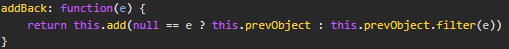
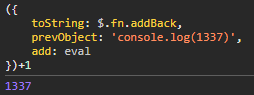
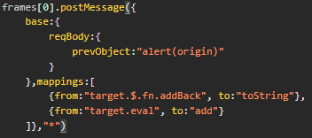

This challenge has two pages, a fairly functionless outer page, and an inner page with a postMessage listener that performs some rich hydration of an object before using it to make a mocked post request to a non existent API endpoint with a body derived from the message. There is no origin check on the listener, the page is frameable, and there is not much else going on here, so it is clear that the way to achieving the XSS involves framing the inner.html page from an attacker page and sending it crafted messages.

## Understanding the inner.html loaded JavaScript files
This page loads three JavaScript files. A jQuery library, a lodash library, and a custom inner.js file. The custom inner.js file has the relevant logic for registering a sketchy looking postMessage handler.

## Understanding the hydration functionality
The inner.html page has the following custom JavaScript to implement a postMessage event handler.

The message event is passed to a rehydration function that takes a list of `from` and `to` mapping values from the message data and uses lodash's get method to get a potentially nested property from the event and assign it as a value to `event.data.base.reqBody[to]`. Notably, this is getting a potentially nested value from the event, not event.data. This oversight allows for very interesting behavior. By reading a property from `event.target`, we can read from the global window object of the inner.html page. This allows us to set a wide variety of values on the `event.data.base.reqBody` object before it gets used later in the code. Interestingly, it is not stringified later in the code, and instead is passed as a raw object to fetch as the body. This behavior is incorrect and will lead to toString being implicitly called on the object, returning `"[object Object]"` instead of the likely intended behavior.

## Achieving XSS
There are two crucial pieces here that allow this strange code to lead to XSS. The first being the ability to copy properties from `window` to controlled values of the `event.data.base.reqBody` object. The second being the implicit toString call of `event.data.base.reqBody` when it is incorrectly passed to fetch.

By abusing this implicit toString call, we can copy a function from the global window object to `reqBody.toString` and be able to execute functions in the global scope without argument control, and with `this` referring to `reqBody` when they execute. Unfortunately, most of the interesting functions we may want to call, like `document.write`, or `alert` do not allow invocation with an improper `this` object, and instead would have to be bound to `document` and `window` respectively if called this way.

However, given that we control the `this` value, we can look for gadget functions on the global scope that do something like the following hypothetical `winExample` function:

If a function like this existed on the global scope, it would be a gadget that would allow us to achieve function call of another arbitrary function from the window with an arbitrary argument. Fortunately, both the lodash and jQuery libraries are loaded on this page and exposed on the global scope. After examination of certain jQuery libraries, we can find a candidate gadget function exposed at `$.fn.addBack`.

The jQuery addBack function takes an argument, which when invoked via implicit toString will always be `undefined`, and calls `this.add()` with the value of `this.prevObject` if the provided argument is null. This is exactly the gadget we need to turn implicit toString call into useable XSS. A crafted object like the following will lead to code execution.

Putting all of these ideas together, we can build out a postMessage body that will result in a crafted object being created that leads to execution of arbitrary JavaScript when being implicitly converted to a string.

## Full payload
A full payload to accomplish this can be seen [here.](https://www.turb0.one/files/9187cc52-fd4d-49c6-a336-0ce8b5139394/xsschal2minimal/99ebcf7b-130b-431c-b7a8-84fe09192d52-solution.html)

It abuses the postMessage listener to copy the `$.fn.addBack` gadget to `event.data.reqBody` as `toString`, as well as set `eval` to its `add` property, so that when the `addBack` gadget is called, the `eval` function set as `add` is called with the `prevObject` string containing the arbitrary JavaScript to execute.
