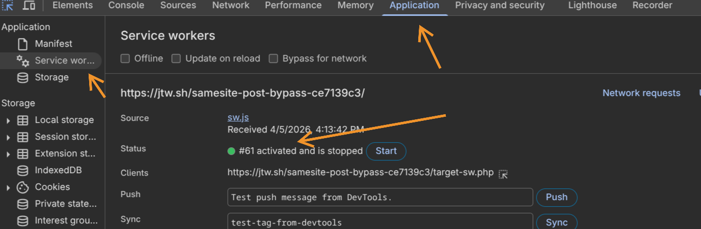
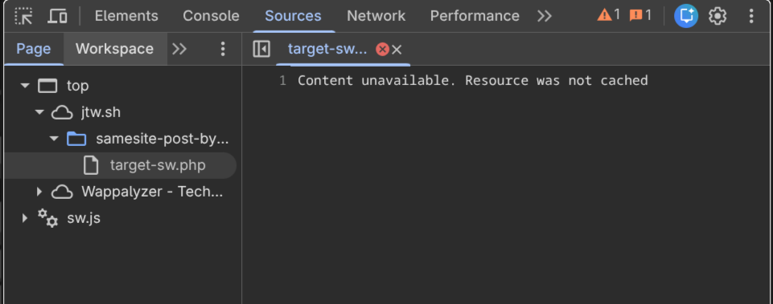

# Breaking SameSite=Strict in Chrome

Hello Hackers. Me and [bug_blitzer](https://www.linkedin.com/in/ayesha-attaria-b54479294) found a Chrome bug that lets you bypass SameSite=Strict using DevTools. Opening DevTools triggered a cross-site POST request with full auth cookies attached, a CSRF that shouldn't have worked.

## What's SameSite=Strict?

[SameSite=Strict](https://developer.mozilla.org/en-US/docs/Web/HTTP/Headers/Set-Cookie/SameSite) is the strongest CSRF protection available. It blocks cookies from being sent on any cross-site request, including cross-site POSTs from external domains. Bypassing it means authenticating actions across origins, which directly exposes users to account takeover, unauthorized transfers, and password changes.

## The Hunt for Root Cause

The problem: normally you'd reload the page with DevTools open and watch the initiator stack. But since *opening DevTools was the trigger*, that approach was impossible.

`chrome://net-export` was the next attempt. It didn't work either, service workers intercept and replay traffic [above the network stack layer](https://textslashplain.com/2020/01/17/capture-network-logs-from-edge-and-chrome/#:~:text=Can%E2%80%99t%20Capture%20Requests%20that%20Don%E2%80%99t%20Reach%20the%20Network%20Stack), so the requests never appeared in the logs.

Unregistering the service worker did the trick.



So it was the service worker. But why would one cause SameSite cookies to attach to what was clearly a cross-site request?

## The Attack Vector

[Service workers](https://developer.mozilla.org/en-US/docs/Web/API/Service_Worker_API) are origin-level network proxies that intercept requests, run independently of any page, and persist even when all tabs are closed. The important thing here isn't what the service worker *does*, just that it *exists* on the target origin. That alone is the precondition.

Here's the full chain:

**Step 1 - Service Worker on Target:**
The target needs a registered service worker. It doesn't need custom logic, a standard caching or push notification SW is enough. Most modern web apps have one.

**Step 2 - Victim Visits Attacker's Page:**
The attacker's page fires a cross-site POST to the target. No SameSite=Strict cookies attach, expected. The browser navigates to the target page.

**Step 3 - Victim Opens DevTools:**
`F12`, `Ctrl+Shift+I`, or right-click -> Inspect. Chrome's Inspector Resource Content Loader tries to fetch the page source. The POST response wasn't cached, so it issues a re-fetch.

**Step 4 - The Bypass:**
That re-fetch is issued with `kNoCors + kOnlyIfCached`, a combination that violates the [Fetch spec](https://fetch.spec.whatwg.org/#concept-request-cache-mode), which requires `kOnlyIfCached` to be paired with `kSameOrigin` exclusively.

Every fetch has two properties living in different layers of the Chromium stack:

| Property | Layer | Controls |
|---|---|---|
| `RequestMode` | Network Service | *Where* the request is allowed to go |
| `FetchCacheMode` | Blink | *Whether* cache or network gets touched |

The relevant values:

```cpp
// services/network/public/mojom/fetch_api.mojom
enum RequestMode {
  kSameOrigin,  // Cross-origin? Chrome kills the fetch immediately.
  kNoCors,      // Default. Goes anywhere, response opaque. No origin restriction.
};

// third_party/blink/public/mojom/fetch/fetch_api_request.mojom
enum FetchCacheMode {
  kOnlyIfCached, // Cache hit only. Network error if not found. Never hits the network.
                 // Spec: can ONLY be paired with kSameOrigin.
};
```

Without a service worker, the mismatch is harmless. `kOnlyIfCached` hits the HTTP cache, finds nothing, and DevTools shows "Content unavailable". End of story.



With a service worker present, the SW sits **above** the HTTP cache in the fetch pipeline. It intercepts the `kNoCors + kOnlyIfCached` request, and the cache-only constraint doesn't propagate through the SW code path. Even a bare passthrough worker triggers it:

```js
self.addEventListener('fetch', (event) => {
  event.respondWith(
    fetch(event.request).catch(() => caches.match(event.request))
  );
});
```

What happens internally:

1. Browser dispatches a `fetch` event to the SW with `kNoCors + kOnlyIfCached`.
2. SW doesn't treat `kOnlyIfCached` as a hard security boundary, it falls through.
3. SW calls `fetch(event.request)` from the **target origin's context**.
4. That request is now same-site relative to the target. `SameSite=Strict` cookies attach.
5. POST body replays with full authentication. CSRF executes.


<video controls preload="metadata" width="100%">
  <source src="/writeups/articles/WriteupNo0007/poc.mp4" type="video/mp4" />
</video>

## Going Public

After reporting to Chrome VRP, they assigned it **severity S3 priority P2**. The user interaction requirement (opening DevTools) was considered unlikely in typical browsing scenarios.

[Jorian](https://twitter.com/J0R1AN) also found that `Ctrl+U` (view page source) triggered the same cache issue, and refreshing with resubmission confirmation fired the request again, submitted separately as [Issue-470629629](https://issues.chromium.org/u/1/issues/470629629).

## The Fix

The Chrome team patched this in [`inspector_resource_content_loader.cc`](https://chromium-review.googlesource.com/c/chromium/src/+/7409996). Two lines:

```cpp
// Before (broken): mode defaulted to kNoCors, violating the Fetch spec.
// After (fixed):
resource_request.SetMode(network::mojom::RequestMode::kSameOrigin);
resource_request.SetCacheMode(blink::mojom::FetchCacheMode::kOnlyIfCached);
```

`kSameOrigin + kOnlyIfCached` together mean that if the request does reach the service worker, the SW is constrained to serving a cached response only. It cannot make a real outbound network fetch, no cookies attach, no POST body replays. The fix doesn't prevent the SW from seeing the request, it limits what the SW is allowed to do with it.

One wrong default request mode thats all it takes.

---

*Questions? Found something similar? Feel free to reach out, always interested in discussing weird browser behavior and security boundaries.*
