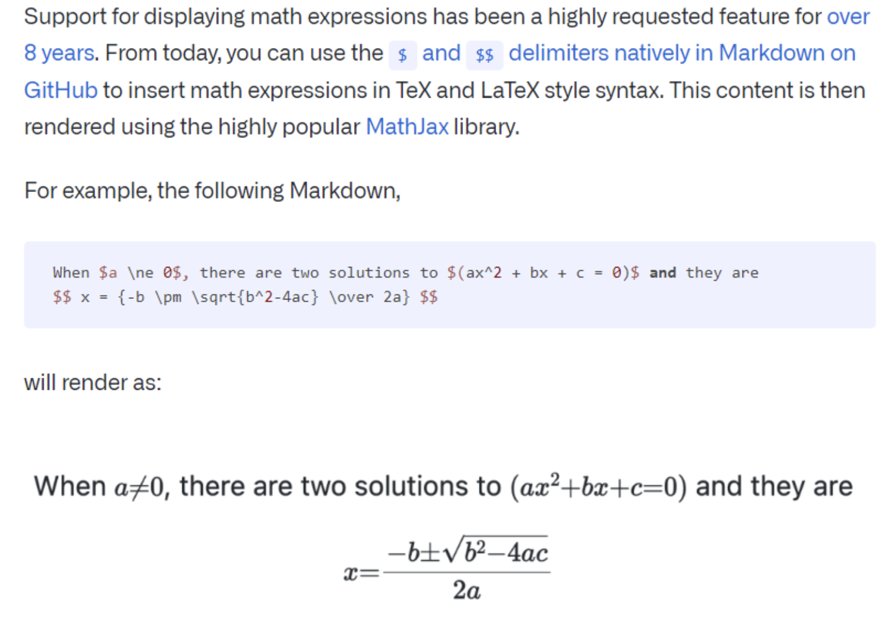
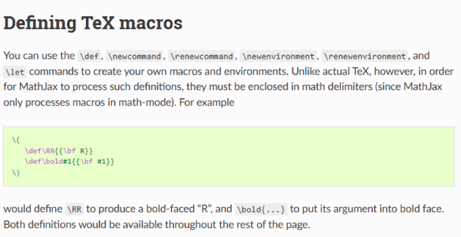
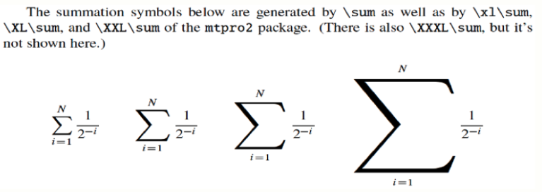
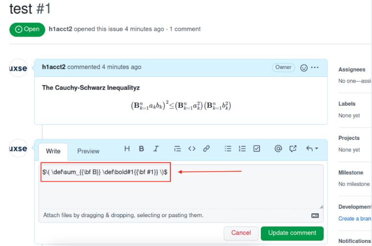
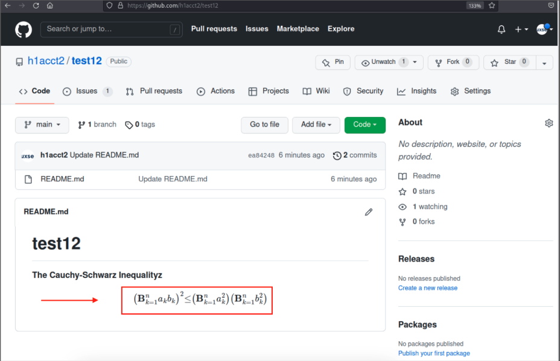
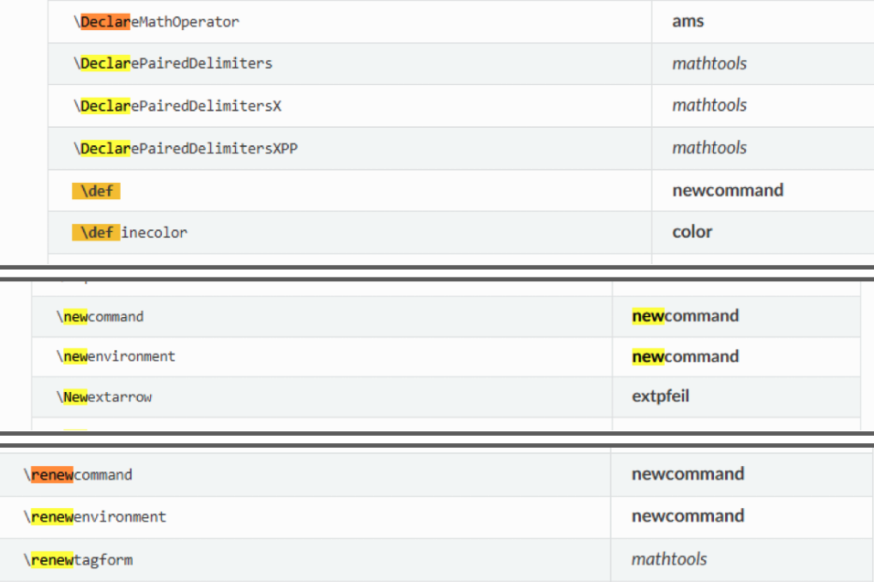
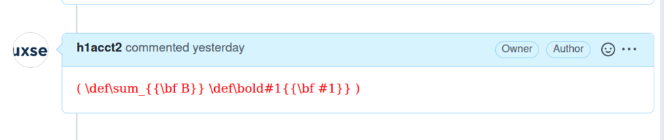

# MathJax macro redefinition allows overriding built-in operators

## Introduction

GitHub extended Markdown functionality through the MathJax library (see blog post [here](https://github.blog/2022-05-19-math-support-in-markdown/)). GitHub gave users the ability to render mathematical equations in GitHub README files, Wiki pages, comments, etc. This is a fairly harmless feature until we analyze the library's native macros in the context of data rendered across the GitHub repo and Issues data plane.



## The Problem: Greetings 'TeX Macros'

TeX is an input processor that converts mathematical notation into MathJax's internal format, MathML (i.e., TeX -> MathML converter). Macros such as `\def`, `\newcommand`, and `\newenvironment` can be used to create your own macros and environments. Specifically, MathJax's `newcommand` package stores every `\def`, `\newcommand`, `\let` macro in a dedicated, initially-empty `CommandMap` named `new-Command`.



## The Theory

Per the above, defining `\RR` as a bold-faced "R" is intended. However, can native symbols/operators like 'Σ' (sum) or `sqrt` in MathJax be re-defined (i.e., overwritten or shadowed) to appear as something else (malicious text/code) in a public repo's README.md file?



## Testing the Theory via GitHub Issues

When setting the following payload in a GitHub Issue for a public GitHub repo on github.com, it was possible to overwrite the native 'Σ' Sigma (sum) mathematical symbol/operator to appear as a bold-faced "B" by re-defining its rendering, successfully overwriting the content in the repo's README.md file. This impacted github.com, gist.github.com, and GitHub mobile apps.

### Github Issue with Injected Payload



### Injection overwrites content in the victim's repo



## Technical Analysis: Why did this happen?

MathJax's `newcommand` package stores every `\def`, `\newcommand`, `\let` definition in a dedicated, initially-empty `CommandMap` named `new-Command`. That map is registered into the parser's macro handler ahead of the base maps, and the write path performs no check against base, so a user `\sum` is inserted alongside (not over) the native one. Since `new-Command` is looked up first (higher priority), it returns the user entry and never reaches the base operator (i.e., the native ∑ is occluded, not deleted).

The registration, where the map is created empty and inserted with priority `-1`:

```ts
// NewcommandConfiguration.ts  (init)
new sm.CommandMap(NewcommandUtil.NEW_COMMAND, {}, {}); // 'new-Command', empty

config.append(Configuration.local({
  handler: { macro: [NewcommandUtil.NEW_DELIMITER,
                     NewcommandUtil.NEW_COMMAND] }, // added to the macro handler
  priority: -1                                      // ← positions it ahead of base
}));
```

Init creates `new sm.CommandMap(NewcommandUtil.NEW_COMMAND, {}, {})` and appends a local configuration whose macro handler list contains `NEW_COMMAND`, at `priority: -1`.

The write path, which just adds to that map with no base lookup:

```ts
// NewcommandUtil.ts
export function addMacro(parser, cs, func, attr, symbol = '') {
  const handler = parser.configuration.handlers.retrieve(NEW_COMMAND); // 'new-Command'
  handler.add(cs, new Macro(symbol ? symbol : cs, func, attr));        // no existence check
}

[...]

export const NEW_COMMAND = 'new-Command';
```

`NEW_COMMAND` is the constant `'new-Command'`, and `addMacro` retrieves that map and calls `handler.add(cs, new Macro(...))`.

```text
TeX input jax ── parser.configuration.handlers
resolve  \sum  ──▶  "macro" handler = ordered list of maps, 1st match wins
  ┌───────────────────────────────────────────────────────────────────┐
  │ new-Command  (CommandMap) registered via local config, priority -1│
  │     { sum → Macro(→ {\bf B}) }              ── HIT: return here   │
  ├───────────────────────────────────────────────────────────────────┤
  │ base maps    ( sum → mo(∑) )   later priority (default; value n/v)│
  │                                             ── never reached      │
  └───────────────────────────────────────────────────────────────────┘

  write path (define time):
    \def ─▶ addMacro('sum', …)
    handlers.retrieve('new-Command').add('sum', new Macro(…))
    // writes to new-Command only; base map untouched → shadow/override
```

## Additional variants

All macros below could be used to win priority mapping to override native operators in any public repo, with varying levels of impact: `\def` and `\newcommand` being the highest impact (i.e., overwriting content) versus `\definecolor` being the lowest impact (i.e., re-defining text color).



## Mitigation

During the re-test, it was found GitHub disallowed use of the `newcommand` package, preventing usage of the `\def` macro, among others, in this case. Refusing the definition at define-time was a robust solution for handling untrusted input:

```js
window.MathJax = { tex: { packages: { '[-]': ['newcommand'] } } };
```



## Disclosure timeline

- **May 20, 2022**: Reported to GitHub
- **May 20, 2022**: GitHub fixed the issue
- **May to August, 2022**: Various payouts throughout this time for additional variants reported
